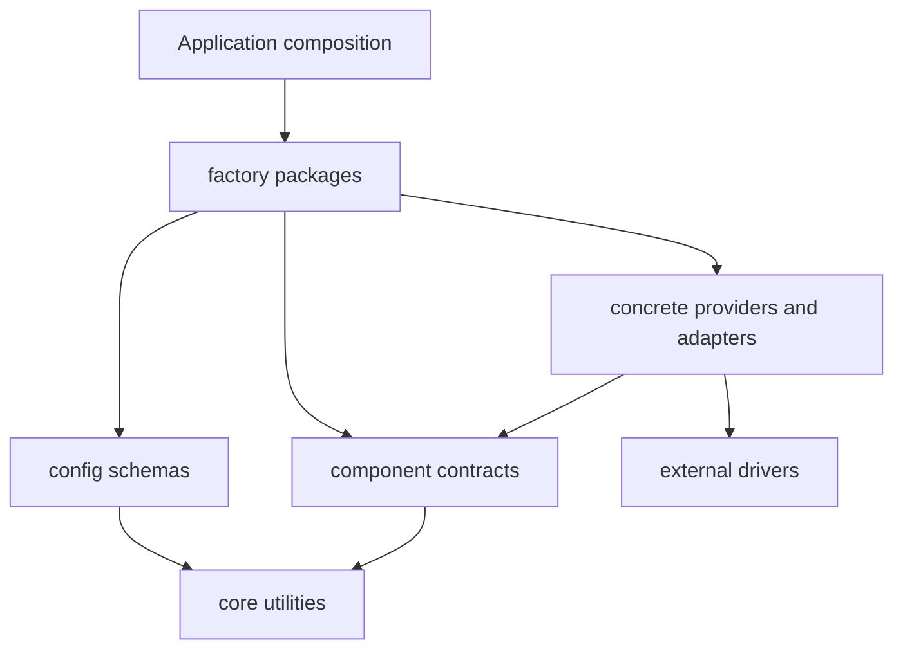

# Architecture

go-atlas is a toolkit composed of Go packages in one root module. Applications own construction, startup and shutdown; individual packages can be used
without a framework bootstrap. The integration suite is a separate module under `tests/integration`.

## Dependency boundaries

Dependencies are governed at the Go package level. Top-level directories describe capabilities, not strictly ordered layers: factories and concrete
adapters intentionally connect capabilities. Go rejects actual import cycles; a cycle in an aggregated directory diagram is not an import cycle.

| Package role | Allowed dependencies and responsibility |
|--------------|-----------------------------------------|
| `core/*` | Standard library and other `core/*` packages. Narrow exceptions below. |
| `config/*` schema packages | Schemas, defaults and validation, one package per capability (`grpcconfig`, `redisconfig`, ...). Import only `core/*`, other schema packages, config internals and validation libraries. No runtime clients or component constructors. The root `config` package declares no types. |
| `config/loader/*` | Configuration sources and secret resolution; may use `security/secrets`, never transport clients directly. |
| `domain/*` | Domain helpers, `core/*` and observability interfaces. Backend translators remain separate subpackages. |
| `data/*` | Data contracts and implementations; storage providers depend on consumer-defined contracts. |
| `infrastructure/*` | Connection construction and lifecycle for external systems. |
| `observability/tracing`, `observability/metrics` | Backend-neutral contracts and dispatch to the `adapters` interface package; no concrete adapter or transport import. |
| `*/adapters/*`, `*/storages/*`, `*/providers/*` | Concrete integration dependencies and the contracts they implement. |
| `*/factory` | Composition from schemas and injected dependencies; may import concrete adapters, clients, providers and other factories. The only readers of schemas besides `config/*` itself, together with the factory helper `transport/internal/factoryconv`. |
| `plugins` | Runtime loader for `.so` plugins: discovery, signature checks, sandboxing, lifecycle and crash quarantine. The manager owns loaded plugins; `plugins/factory` maps `pluginsconfig` to options. |
| `transport/*`, `auth/*`, `security/*`, `service/*` | Runtime capabilities assembled from interfaces, core helpers and required integrations. |

`core/io/spoolbudget` uses `golang.org/x/sync/semaphore`. Linux capability, landlock, nonewprivs, rlimits and seccomp implementations use
`golang.org/x/sys/unix`. These are explicit package-scoped exceptions. Universal value types (`optional`, `redacted`) have no external production
imports; database codecs belong in `data/mongo/bsoncodec`.

Runtime and contract packages take generated options and injected dependencies: they never import schema packages or `*/factory` packages.
A component that needs an outbound client accepts it (for example `oidc.WithHTTPClient(*http.Client)`); the factory builds the resilient
client from configuration.

`make check-architecture` parses production imports on every platform and enforces the core, schema, domain and base-observability boundaries above,
that runtime packages read no schemas and that only composition imports factories. The same check runs in CI. Test dependencies and the separate
integration module are excluded. Other composition rules require ordinary code review; the check does not claim to enforce a complete layer ordering.

## Configuration and adapters

Package constructors accept required dependencies as positional arguments and generated functional options for tunables. Configuration structs are
schemas in the `config/*` packages; runtime packages do not expose another mutable public Config as an alternative to options. Factories validate
schemas and materialize options. Nil optional telemetry dependencies use no-ops; required storage, codecs and credentials remain required.

Outbound proxy mapping lives in `transport/proxydial/factory`: `HTTPClientOptions(cfg.Proxy)` and `GRPCClientOptions(cfg.Proxy)`. Client health and HTTP
SSRF mapping live in `transport/http/client/factory` and `transport/grpc/client/factory`. See the [proxy guide](proxy.md).

BSON encoding of `optional.Optional[T]` uses `data/mongo/bsoncodec.NewRegistry()`. `data/mongo` installs this registry for clients it constructs unless
an explicit registry overrides it. Supplied clients and standalone BSON encoders/decoders must be configured by their owners. An unconfigured codec
fails explicitly instead of silently serializing private fields. RedactedString retains a fixed BSON string redaction hook without importing the driver,
so redaction works with the default registry too.

## Lifecycle and state ownership

Instances own their clients, queues and worker lifecycles unless a constructor explicitly accepts an externally owned dependency. Background tasks must
expose errors at registration/startup and have a bounded stop path. Callbacks and drivers must honor their contexts; Go cannot forcibly stop a callback
that ignores cancellation.

The toolkit contains opt-in process-wide facilities: shutdown hooks, panic handlers and signal dispatch, plus synchronized implementation caches. There
is no blanket guarantee of zero global state or zero initialization. Prefer scoped `core/runtime.HookGroup` and instance-owned dependencies when
components must be stopped or tested independently. Package-specific thread-safety contracts take precedence over general descriptions.

## Delivery and recovery contracts

| Component | Contract |
|-----------|----------|
| `data/saga` | CAS acquires a bounded execution lease before callbacks. Stage intent and successful members of a failed parallel stage are persisted. Recovery excludes active leases. |
| Saga callbacks | Must be idempotent and cancellation-aware. Use `ExecutionFromContext` for stable step keys and increasing fencing tokens; external systems must enforce fencing when needed. |
| Idempotency | Completion and failed-request release compare the original ownership token atomically. Unconditional deletion is administrative only. |
| Scheduler | Atomic claim and `FinishRun` fence ownership at both transitions; stale completion cannot overwrite a newer run or task configuration. |
| Health/outbox startup | Constructors do not register tasks. Explicit registration reports errors; factories perform it before returning. Partial outbox registration gates callbacks until retry succeeds. |
| gRPC pool | Client bindings preserve the complete dial policy. Per-target capacity includes borrowed, idle and in-flight creations; stop cancels and joins factories before completing. |
| Saga recovery | `RegisterRecovery(ctx)` reports scheduler failures. Manual recovery remains available until registration succeeds. Recovery, execution, step and persistence budgets are maximum deadlines and preserve any earlier caller deadline. |
| `service/dispatch` with WAL | Logged admission and asynchronous at-least-once delivery. Workers continue retries during an outage; shutdown reports retained backlog. |
| `service/dispatch` without WAL | Volatile admission, finite retries, no crash recovery. |
| `domain/eventbus/uow` | In-process post-commit effects. Compensation detaches caller cancellation but has a configurable overall deadline. No crash durability. |
| Tracing | Extract, Start and Inject share one context representation. Unsampled spans retain valid propagation context; RecordOnly spans are not exported. |

A saga cannot atomically commit an external effect and its checkpoint. Recovery may repeat actions and compensate uncertain persisted intents; handlers
must tolerate absent or already-undone effects. A lease prevents cooperative executors from overlapping. Remote fencing or idempotency is still required
when an old process can resume after its lease expires. See [saga](data/saga.md) and the [migration decision](adr/2026-09-25-recovery-boundaries.md).

WAL admission is a page-cache append, not an immediate fsync acknowledgement. Crash durability starts after a successful sync; OS scheduling and I/O
failures can extend the configured sync cadence. Shutdown returns delivery and journal failures rather than promising an unconditional full drain. See
[dispatch](../service/dispatch/README.md) and [WAL](../core/io/wal/README.md).

## Repository map and conventions

[AGENTS.md](../AGENTS.md) is the package map and contribution convention reference. Generated options are produced by optgen from private options
structs. Public packages include godoc, README and behavior tests; benchmarks cover hot paths. Internal packages follow the documented exemptions. This
document is authoritative for architecture; `.ai-factory/ARCHITECTURE.md` links here instead of duplicating dependency rules.
