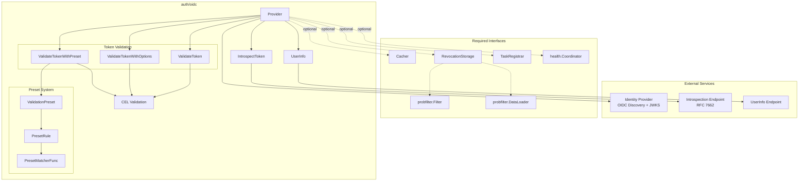
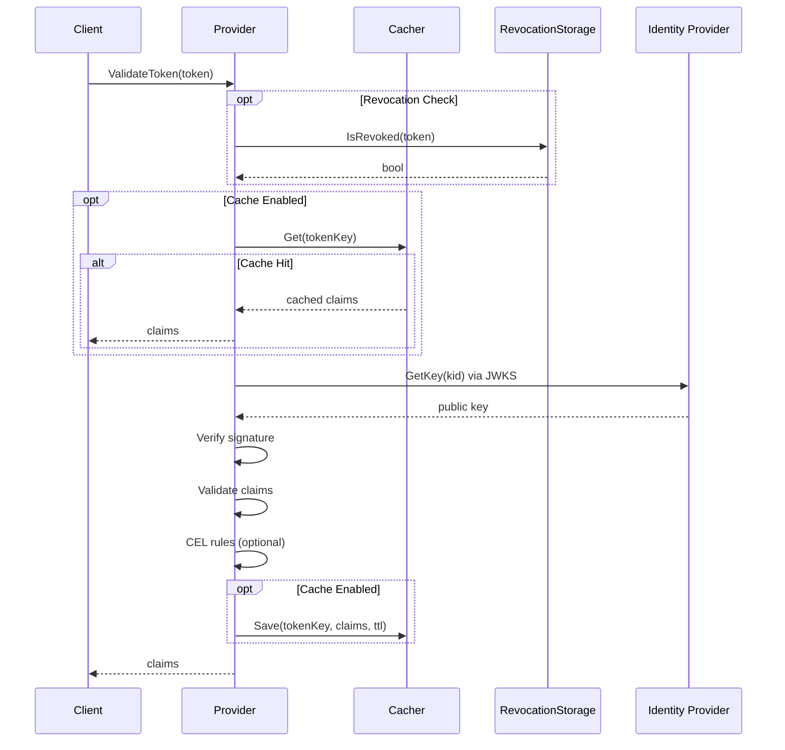
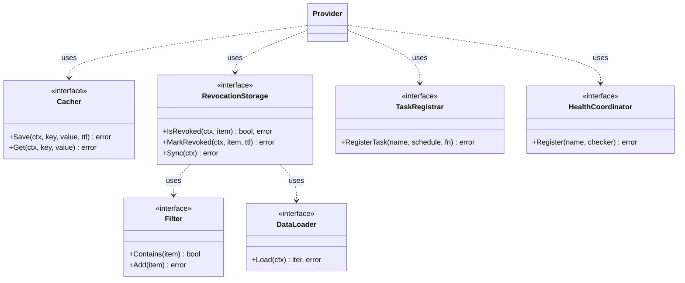

# OpenID Connect (OIDC) Authentication

JWT token validation with automatic JWKS rotation, claims validation, presets, introspection, and revocation.

---

## Table of Contents

- [Overview](#overview)
- [Architecture](#architecture)
  - [Component Relationships](#component-relationships)
  - [Token Validation Flow](#token-validation-flow)
  - [Interfaces](#interfaces)
- [Package Map](#package-map)
- [Quick Start](#quick-start)
- [Configuration Layers](#configuration-layers)
- [YAML Application Config](#yaml-application-config)
  - [Root Fields](#root-fields)
  - [Client Credentials](#client-credentials)
  - [Introspection](#introspection)
  - [Token Validation](#token-validation)
  - [Claims Validation](#claims-validation)
  - [CEL Expressions (YAML)](#cel-expressions-yaml)
  - [Presets and Selectors](#presets-and-selectors)
  - [Cache](#cache)
  - [JWKS](#jwks)
  - [Revocation](#revocation)
- [JSON Service Config](#json-service-config)
  - [Loading](#loading)
  - [Service Config Structure](#service-config-structure)
  - [Validation Rules](#validation-rules)
  - [Scopes Configuration](#scopes-configuration)
  - [Token Lifetime](#token-lifetime)
  - [CEL Rules](#cel-rules)
  - [Presets (JSON)](#presets-json)
  - [Preset Selection Rules](#preset-selection-rules)
  - [Condition Types](#condition-types)
- [Factory Builder](#factory-builder)
  - [Basic Usage](#basic-usage)
  - [Injecting Dependencies](#injecting-dependencies)
  - [What the Builder Wires](#what-the-builder-wires)
  - [Combined: YAML + Service Config](#combined-yaml--service-config)
- [Go API](#go-api)
  - [Standalone Provider](#standalone-provider)
  - [Validation Presets (Go)](#validation-presets-go)
  - [Matchers](#matchers)
  - [CEL Validation (Go)](#cel-validation-go)
  - [Token Revocation (Go)](#token-revocation-go)
  - [Token Introspection (Go)](#token-introspection-go)
  - [gRPC Integration](#grpc-integration)
  - [gRPC Claims Struct](#grpc-claims-struct)
- [Health and Metrics](#health-and-metrics)
- [Scheduled Background Tasks](#scheduled-background-tasks)
- [Real-World Examples](#real-world-examples)
  - [REST API with Keycloak](#rest-api-with-keycloak)
  - [Microservices with Shared IdP](#microservices-with-shared-idp)
  - [Multi-Tenant SaaS](#multi-tenant-saas)
  - [Service Mesh (Internal Only)](#service-mesh-internal-only)
- [Configuration Validation](#configuration-validation)
---

## Overview

The `auth/oidc` package is a transport-agnostic OIDC Provider that covers the token validation lifecycle:

1. **Discovery** — fetches OIDC metadata from the well-known endpoint.
2. **JWKS** — loads and caches JSON Web Key Sets with automatic or scheduled refresh.
3. **Validation** — verifies signatures, standard claims, custom claims, and CEL rules.
4. **Caching** — optional token cache avoids redundant validation.
5. **Revocation** — checks tokens against a revocation store (local, remote, or bloom filter).
6. **Introspection** — RFC 7662 token introspection for opaque tokens.

The provider integrates with the gRPC auth interceptor, HTTP middleware, health checks, and Prometheus metrics.

## Architecture

### Component Relationships



### Token Validation Flow



### Interfaces



**Cacher** — caches validated tokens to avoid repeated validation.

```go
type Cacher interface {
    Save(ctx context.Context, key string, value any, ttl ...time.Duration) error
    Get(ctx context.Context, key string, value any) error
}
```

**RevocationStorage** — tracks revoked tokens. Can use probabilistic filters (Bloom/Cuckoo) for efficiency.

```go
type RevocationStorage interface {
    IsRevoked(ctx context.Context, item string) (bool, error)
    MarkRevoked(ctx context.Context, item string, ttl time.Duration) error
    Sync(ctx context.Context) error
}
```

**TaskRegistrar** — schedules background tasks (JWKS refresh, revocation sync).

```go
type TaskRegistrar interface {
    RegisterTask(name string, schedule string, fn func(ctx context.Context) error) error
}
```

**health.Coordinator** — registers health checks.

```go
type Coordinator interface {
    Register(name string, checker Checker) error
}
```

## What's provided

- A core `Provider`: discovery, JWKS validation, claims and CEL-based rules, presets, revocation, introspection.
- A YAML-driven builder that constructs the `Provider` from the `auth.oidc` config block and wires logger, scheduler, token cache, and revocation
  backend.
- A gRPC adapter (`AuthFunc` + `Claims` struct) and a default validator for use with gRPC interceptors.

## Quick Start

### With Config + Factory (recommended)

```go
provider, err := oidcfactory.New(cfg.Auth.OIDC).
    UseLogger(logger).
    UseScheduler(scheduler).
    UseTokenCache(redisCache).
    Build(ctx)
if err != nil {
    return fmt.Errorf("create oidc provider: %w", err)
}
defer provider.Close()

claims, err := provider.ValidateToken(ctx, bearerToken)
```

### With JSON Service Config

```go
provider, err := oidc.NewProvider(ctx, discoveryURL,
    oidc.WithServiceConfigPath("./config/oidc-rules.json"),
    oidc.WithLogger(logger),
)
```

### Standalone Provider (no config)

```go
provider, err := oidc.NewProvider(ctx,
    "https://auth.example.com/.well-known/openid-configuration",
    oidc.WithDefaultValidationOptions(
        oidc.WithValidationIssuer("https://auth.example.com"),
        oidc.WithValidationAudience("my-service"),
    ),
    oidc.WithLogger(logger),
)
if err != nil {
    return err
}
defer provider.Close()

claims, err := provider.ValidateToken(ctx, bearerToken)
// claims is map[string]any with all JWT claims
```

---

## Configuration Layers

| Layer | Format | Purpose | Loaded by |
|-------|--------|---------|-----------|
| **YAML application config** | YAML | Infrastructure: discovery URL, credentials, cache, JWKS, revocation, schedules | `config.OIDC` via app loader |
| **JSON service config** | JSON | Validation logic: claims rules, presets, selection rules, CEL | `oidc.LoadServiceConfig()` / `WithServiceConfigPath()` |

The two layers are complementary. YAML handles "how to connect" and "what infrastructure to use". JSON handles "what tokens to accept".

```
┌──────────────────────────────────────────────────────────────┐
│  YAML config (config.OIDC)                                   │
│  ├── discoveryUrl, clockSkew                                 │
│  ├── clientCredentials (clientId, clientSecret)               │
│  ├── introspection (enabled)                                 │
│  ├── cache, jwks, revocation                                 │
│  └── validation, presets, selectors (YAML-native)            │
│                                                              │
│        ProviderBuilder.Build(ctx)                            │
│              ↓                                               │
│        oidc.NewProvider(discoveryUrl, opts...)                │
│              ↓                                               │
│  JSON service config (oidc.ServiceConfig) ← optional overlay │
│  ├── default_validation (claims, scopes, CEL rules)          │
│  ├── presets (named validation rule sets)                     │
│  └── preset_rules (automatic selection conditions)           │
└──────────────────────────────────────────────────────────────┘
```

When both layers define validation/presets, the JSON service config **overrides** the YAML values.

---

## YAML Application Config

The YAML config maps to the `config.OIDC` Go struct. All field names use **camelCase** YAML tags.

### Root Fields

```yaml
oidc:
  discoveryUrl: "https://auth.example.com/.well-known/openid-configuration"
  clockSkew: 10s
```

| Field | Type | Required | Default | Description |
|-------|------|----------|---------|-------------|
| `discoveryUrl` | `string` | Yes | — | OIDC discovery endpoint URL |
| `clockSkew` | `duration` | No | `10s` | Acceptable clock skew for time-based claims. Min: `1s`, max: `1m` |

### Client Credentials

Shared OAuth2 client credentials used by introspection and future client credentials flows.

```yaml
oidc:
  clientCredentials:
    clientId: "my-service"
    clientSecret: "${OIDC_CLIENT_SECRET}"
```

| Field | Type | Required | Description |
|-------|------|----------|-------------|
| `clientId` | `string` | Yes (if section present) | OAuth2 client identifier |
| `clientSecret` | `string` | Yes (if section present) | OAuth2 client secret. Env-var substitution supported. Stored as `Secret` — redacted in logs |

The `clientSecret` field uses the `Secret` type internally. It is automatically redacted in:
- Log output (`<redacted>`)
- JSON/YAML marshaling (`<redacted>`)
- `fmt.Stringer` / `fmt.GoStringer`

To access the raw value, the factory calls `.Expose()` at the point of use only.

### Introspection

Controls RFC 7662 token introspection. Credentials come from the `clientCredentials` section.

```yaml
oidc:
  clientCredentials:
    clientId: "my-service"
    clientSecret: "${OIDC_CLIENT_SECRET}"
  introspection:
    enabled: true
    strict: true              # production: reject tokens when IdP is unreachable
```

| Field | Type | Required | Default | Description |
|-------|------|----------|---------|-------------|
| `enabled` | `bool` | No | `false` | Toggle introspection on/off |
| `strict` | `bool` | No | `false` | Fail-closed: reject tokens with `ErrIntrospection` when the introspection endpoint is unreachable |

**Validation rule:** If `introspection.enabled` is `true`, the `clientCredentials` section **must** be configured. The application will fail
validation at startup otherwise.

#### Fail-open vs strict mode

By default introspection is **fail-open**: if the IdP is unreachable (network error, 5xx, parse failure) the provider logs a warning, increments
`oidc_revocation_check_errors_total`, and accepts the token on its signature alone. That keeps authentication available during IdP degradation but lets
revoked tokens slip through until the endpoint is back. **Strict mode** flips this trade-off: any introspection failure rejects the token with
`ErrIntrospection`. Use it in production when revocation is a hard requirement (logout, compromised credentials, session cutoff).

| Scenario | Default (fail-open) | `strict: true` |
|---|---|---|
| Endpoint returns `200 OK`, `active=true` | accept | accept |
| Endpoint returns `200 OK`, `active=false` | reject (`ErrTokenRevoked`) | reject (`ErrTokenRevoked`) |
| Network error / DNS failure | warn, accept (signature only) | warn, reject (`ErrIntrospection`) |
| Endpoint returns 5xx / unparseable body | warn, accept (signature only) | warn, reject (`ErrIntrospection`) |
| `introspection.enabled: false` | falls through to revocation storage if configured | same |

The behavior also exists on the Go API: `oidc.WithIntrospectionStrict()` sits next to `oidc.WithIntrospection(clientID, secret)` and can be passed to
`oidc.NewProvider` directly without going through YAML.

**Operator guidance:** turn `strict` on in production when introspection is enabled. Pair it with a generous IdP timeout and retries on the HTTP client
(both honored via `oidc.proxy` and the shared `httpclient`) so that transient hiccups don't translate to user-visible 401s. Cache hits never go to the
network — `strict` only affects requests that actually reach the endpoint.

### Token Validation

YAML-native validation rules applied as default options to every `ValidateToken` call.

```yaml
oidc:
  validation:
    issuer: "https://auth.example.com"
    maxTokenLifetime: 24h
    expression:
      expression: 'has(claims.email) && claims.email_verified == true'
      name: "verified-email"
    claims:
      required: ["sub", "aud", "exp", "iat", "iss"]
      audience: ["my-service"]
```

| Field | Type | Required | Default | Description |
|-------|------|----------|---------|-------------|
| `issuer` | `string` | No | — | Expected `iss` claim. Must be a valid URL |
| `maxTokenLifetime` | `duration` | No | `0` (disabled) | Reject tokens with `exp - iat` exceeding this value |
| `expression` | `object` | No | — | Single CEL expression for custom validation |
| `claims` | `object` | No | — | Claims validation rules (see below) |

### Claims Validation

```yaml
oidc:
  validation:
    claims:
      required: ["sub", "aud", "exp", "iat", "iss"]
      expected:
        email_verified: "true"
      ignored: ["nonce"]
      audience: ["my-service", "my-other-service"]
      allowedClientIds: ["frontend-app", "mobile-app"]
      requiredScopes: ["openid", "profile"]
      requireAuthorizedParty: true
      allowedAuthorizedParties: ["frontend-app"]
      allowMissingSubject: false
```

| Field | Type | Default | Description |
|-------|------|---------|-------------|
| `required` | `[]string` | — | Claims that must be present in every token |
| `expected` | `map[string]string` | — | Claims that must have exact string values |
| `ignored` | `[]string` | — | Claims to skip during validation |
| `audience` | `[]string` | — | Expected `aud` claim values (token must contain at least one) |
| `allowedClientIds` | `[]string` | — | Whitelist of `client_id` values. Empty = all allowed |
| `requiredScopes` | `[]string` | — | Required OAuth2 scopes in the `scope` claim |
| `requireAuthorizedParty` | `bool` | `false` | Require the `azp` (authorized party) claim |
| `allowedAuthorizedParties` | `[]string` | — | Whitelist of `azp` values. Required when `requireAuthorizedParty: true` |
| `allowMissingSubject` | `bool` | `false` | Allow tokens without `sub` claim (for client credentials flow tokens) |

### CEL Expressions (YAML)

YAML supports a single CEL expression per validation block (or per preset). For multiple CEL rules, use the JSON service config.

```yaml
oidc:
  validation:
    expression:
      expression: 'has(claims.org_id) && claims.org_id != ""'
      name: "require-org"
```

| Field | Type | Required | Description |
|-------|------|----------|-------------|
| `expression` | `string` | Yes | CEL expression evaluating to `bool`. Available variable: `claims` (`map[string]any`) |
| `name` | `string` | No | Rule identifier for error messages. Defaults to `"custom-validation"` (or `"<preset-name>-validation"` in presets) |

### Presets and Selectors

YAML presets are named validation rule sets. Selectors automatically choose a preset based on token claims using CEL expressions.

```yaml
oidc:
  presets:
    list:
      - name: admin-token
        issuer: "https://auth.example.com"
        maxTokenLifetime: 2h
        expression:
          expression: 'has(claims.role) && claims.role == "admin"'
          name: "admin-role-check"
        claims:
          required: ["sub", "role"]
          audience: ["admin-portal"]

      - name: service-token
        claims:
          allowMissingSubject: true
          allowedClientIds: ["backend-service"]

    selectors:
      - expression: 'has(claims.role) && claims.role == "admin"'
        priority: 100
        presetName: admin-token

      - expression: 'has(claims.client_id) && !has(claims.sub)'
        priority: 50
        presetName: service-token
```

**Preset fields:**

| Field | Type | Required | Description |
|-------|------|----------|-------------|
| `name` | `string` | Yes | Unique identifier. Pattern: `^[a-z][a-z0-9-]*$` |
| `issuer` | `string` | No | Expected `iss` for this preset |
| `maxTokenLifetime` | `duration` | No | Max token lifetime for this preset |
| `expression` | `object` | No | CEL expression for this preset |
| `claims` | `object` | No | Claims validation (same structure as `validation.claims`) |

**Selector fields:**

| Field | Type | Required | Description |
|-------|------|----------|-------------|
| `expression` | `string` | Yes | CEL expression that evaluates to `bool` |
| `priority` | `int` | No | Evaluation order (higher = evaluated first) |
| `presetName` | `string` | Yes | Name of the preset to apply when matched |

**Rules:**
- `presets.list` and `presets.selectors` must be configured together or both omitted.
- When `ValidateToken` is called, selectors are evaluated by descending priority. The first match applies.

### Cache

Token validation result caching. Requires a `Cacher` implementation (typically Redis-backed) injected via the factory builder.

```yaml
oidc:
  cache:
    enabled: true
    tokensKeyPrefix: "tokens:"
    revokedTokensKeyPrefix: "revoked-tokens:"
```

| Field | Type | Default | Description |
|-------|------|---------|-------------|
| `enabled` | `bool` | `false` | Enable/disable caching |
| `tokensKeyPrefix` | `string` | `"tokens:"` | Cache key prefix for validated tokens |
| `revokedTokensKeyPrefix` | `string` | `"revoked-tokens:"` | Cache key prefix for revoked tokens |

Cache keys are SHA-256 hashes of the raw token, prefixed with the configured prefix.

### JWKS

Controls JSON Web Key Set refresh behavior.

```yaml
oidc:
  jwks:
    refreshEnabled: true
    refreshSchedule: "0 */5 * * * *"
    httpTimeout: 30s
```

| Field | Type | Default | Description |
|-------|------|---------|-------------|
| `refreshEnabled` | `bool` | `true` | Enable proactive JWKS refresh via scheduler |
| `refreshSchedule` | `string` | `"0 0 * * * *"` | Cron expression (6-field with seconds) |
| `httpTimeout` | `duration` | `30s` | HTTP timeout for JWKS endpoint requests |

Without a scheduler, JWKS is refreshed automatically on cache miss.

The HTTP client used for JWKS refresh, OIDC discovery, introspection, userinfo, and URL-based revocation honors `oidc.proxy` (see [Proxy](../proxy.md))
— so a single proxy block applies to every outbound OIDC call. Sub-components (e.g. URL revocation loaders) inherit the Provider's HTTP client via
the `httpclient.HTTPClientSetter` interface.

### Proxy

Outbound HTTP proxy for every OIDC call (discovery, JWKS, introspection, userinfo, URL-based revocation loaders).

```yaml
oidc:
  proxy:
    mode: url
    url: http://proxy.corp.example:3128
```

| Field | Type | Default | Description |
|-------|------|---------|-------------|
| `mode` | `string` | `""` (passthrough) | One of `none` / `url` / `host`. Empty = honor `HTTP_PROXY` / `HTTPS_PROXY` / `NO_PROXY` env vars |
| `url` | `string` | — | Proxy URL when `mode: url`. Schemes: `http`, `https`, `socks5`, `socks5h`. Port required |
| `host` | `string` | — | Proxy hostname when `mode: host` |
| `port` | `int` | — | Proxy port (1–65535) when `mode: host` |
| `auth.username` | `string` | — | Proxy auth username (optional) |
| `auth.password` | `secret` | — | Proxy auth password — supports `$__secret{...}` expansion |

Omit the `proxy` block entirely to keep the env-var passthrough default. Use `mode: none` to disable proxy resolution explicitly. See the [Proxy
guide](../proxy.md) for full mode semantics, TLS-to-proxy options, and operator guidance.

### Revocation

Token/key revocation checking using probabilistic filters (Bloom or Cuckoo).

```yaml
oidc:
  revocation:
    enabled: true
    syncEnabled: true
    syncSchedule: "*/30 * * * * *"
    itemType: "jti"
    filter:
      type: "bloom"
      bloom:
        expectedItems: 1000000
    source:
      url: "https://auth.example.com/revoked-tokens"
      # OR: file: "/etc/oidc/revoked.txt"
```

| Field | Type | Default | Description |
|-------|------|---------|-------------|
| `enabled` | `bool` | `false` | Enable revocation checking |
| `syncEnabled` | `bool` | `true` | Enable periodic sync of revocation data |
| `syncSchedule` | `string` | `"0 0 * * * *"` | Cron expression for sync |
| `itemType` | `string` | `"token"` | What to check: `"token"` (full JWT), `"jti"` (claim), or `"kid"` (key ID) |
| `filter` | `object` | — | Probabilistic filter configuration (`type`, `bloom` or `cuckoo`) |
| `source.url` | `string` | — | URL to fetch revocation list from |
| `source.file` | `string` | — | Local file path for revocation list |

Either `source.url` or `source.file` is required when revocation is enabled.

---

## JSON Service Config

The JSON service config provides fine-grained validation logic. It is loaded at provider startup and compiled (CEL expressions are pre-compiled and
cached).

### Loading

**Via provider option:**

```go
provider, err := oidc.NewProvider(ctx, discoveryURL,
    oidc.WithServiceConfigPath("./config/oidc-service.json"),
    oidc.WithLogger(logger),
)
```

**Via explicit load:**

```go
config, err := oidc.LoadServiceConfig("./config/oidc-service.json")
if err != nil {
    log.Fatal(err)
}
opts, err := config.ToProviderOptions()
if err != nil {
    log.Fatal(err)
}
provider, err := oidc.NewProvider(ctx, discoveryURL, opts...)
```

### Service Config Structure

```json
{
  "version": "1.0",
  "default_validation": { ... },
  "presets": [ ... ],
  "preset_rules": [ ... ]
}
```

| Field | Type | Required | Description |
|-------|------|----------|-------------|
| `version` | `string` | Yes | Schema version. Must be `"1.0"` |
| `default_validation` | `object` | No | Default validation rules for all tokens |
| `presets` | `array` | No | Named validation rule sets |
| `preset_rules` | `array` | No | Rules for automatic preset selection |

### Validation Rules

Used in `default_validation` and in each preset's `validation` field.

```json
{
  "leeway": "10s",
  "verify_expiration": true,
  "verify_not_before": true,
  "verify_issued_at": false,
  "issuer": "https://auth.example.com",
  "audiences": ["my-service"],
  "required_claims": ["sub", "email"],
  "expected_claims": { "email_verified": true },
  "ignored_claims": ["nonce"],
  "allowed_client_ids": ["frontend-app"],
  "require_authorized_party": false,
  "allowed_authorized_parties": [],
  "allow_missing_subject": false,
  "scopes": { ... },
  "token_lifetime": { ... },
  "cel_rules": [ ... ]
}
```

| Field | Type | Default | Description |
|-------|------|---------|-------------|
| `leeway` | `string` (duration) | `"0s"` | Clock skew tolerance for `exp`, `nbf`, `iat` |
| `verify_expiration` | `bool` | `true` | Verify `exp` claim |
| `verify_not_before` | `bool` | `false` | Verify `nbf` claim |
| `verify_issued_at` | `bool` | `false` | Verify `iat` claim |
| `issuer` | `string` | — | Expected `iss` claim (exact match) |
| `audiences` | `[]string` | — | Expected `aud` values (at least one must match) |
| `subject` | `string` | — | Expected `sub` claim (exact match, rarely used) |
| `required_claims` | `[]string` | — | Claims that must be present |
| `expected_claims` | `object` | — | Claims with expected values (string, number, bool, null) |
| `ignored_claims` | `[]string` | — | Claims to skip |
| `allowed_client_ids` | `[]string` | — | Whitelist of `client_id` values |
| `require_authorized_party` | `bool` | `false` | Require `azp` claim |
| `allowed_authorized_parties` | `[]string` | — | Whitelist of `azp` values |
| `allow_missing_subject` | `bool` | `false` | Allow tokens without `sub` |
| `scopes` | `object` | — | Scope validation (see below) |
| `token_lifetime` | `object` | — | Lifetime restrictions (see below) |
| `cel_rules` | `array` | — | Custom CEL validation rules |

### Duration Format

All duration fields accept Go duration syntax:

| Example | Meaning |
|---------|---------|
| `"10s"` | 10 seconds |
| `"5m"` | 5 minutes |
| `"1h30m"` | 1 hour 30 minutes |
| `"24h"` | 24 hours |

### Scopes Configuration

```json
{
  "scopes": {
    "required": ["openid", "profile"],
    "any_of": ["read", "write", "admin"]
  }
}
```

| Field | Logic | Description |
|-------|-------|-------------|
| `required` | AND | All these scopes must be present |
| `any_of` | OR | At least one must be present |
| `all_of` | AND | All must be present (alias for `required`) |

Combined: `required` AND `any_of` — e.g., `openid` AND (`read` OR `write` OR `admin`).

### Token Lifetime

```json
{
  "token_lifetime": {
    "min": "5m",
    "max": "24h"
  }
}
```

| Field | Description |
|-------|-------------|
| `min` | Minimum `exp - iat` (protects against suspiciously short tokens) |
| `max` | Maximum `exp - iat` (security policy compliance) |

### CEL Rules

Multiple CEL rules per validation block. Each rule must return `bool`.

```json
{
  "cel_rules": [
    {
      "name": "company-email",
      "expression": "has(claims.email) && claims.email.endsWith('@company.com')",
      "message": "Only company email addresses are allowed"
    },
    {
      "name": "active-status",
      "expression": "has(claims.status) && claims.status == 'active'",
      "message": "User account must be active"
    }
  ]
}
```

| Field | Type | Required | Description |
|-------|------|----------|-------------|
| `name` | `string` | Yes | Rule identifier (pattern: `^[a-z][a-z0-9-]*$`). Used in error messages |
| `expression` | `string` | Yes | CEL expression. Context variable: `claims` (`map[string]any`) |
| `message` | `string` | No | Custom error message shown when rule fails |

**Available CEL functions:**

| Function | Description |
|----------|-------------|
| `has(map.field)` | Check field presence |
| `string.endsWith(suffix)` | String ends with |
| `string.startsWith(prefix)` | String starts with |
| `string.contains(sub)` | String contains substring |
| `string.split(sep)` | Split string |
| `value in list` | Membership check |
| `list.exists(v, cond)` | Any element satisfies condition |
| `list.all(v, cond)` | All elements satisfy condition |
| `timestamp(int64)` | Create timestamp from epoch seconds |
| `timestamp.getDayOfWeek()` | Day of week (0=Sunday) |

CEL programs are compiled once at load time and cached (LRU, max 1000 entries). Evaluation is limited to 10,000 cost units per rule.

### Presets (JSON)

Named validation rule sets for different token types or use cases.

```json
{
  "presets": [
    {
      "name": "user-api",
      "description": "User-facing API endpoints",
      "validation": {
        "leeway": "10s",
        "audiences": ["web-app", "mobile-app"],
        "required_claims": ["sub", "email", "email_verified"],
        "expected_claims": { "email_verified": true },
        "token_lifetime": { "max": "24h" }
      }
    },
    {
      "name": "internal-service",
      "description": "Service-to-service authentication",
      "validation": {
        "leeway": "5s",
        "audiences": ["internal-api"],
        "allow_missing_subject": true,
        "cel_rules": [
          {
            "name": "service-account",
            "expression": "has(claims.client_id) && claims.client_id.startsWith('svc-')",
            "message": "Only service accounts allowed"
          }
        ]
      }
    }
  ]
}
```

| Field | Type | Required | Description |
|-------|------|----------|-------------|
| `name` | `string` | Yes | Unique identifier. Pattern: `^[a-z][a-z0-9-]*$` |
| `description` | `string` | No | Human-readable description |
| `validation` | `object` | Yes | Validation rules (same structure as `default_validation`) |

**Explicit preset usage in code:**

```go
claims, err := provider.ValidateTokenWithPreset(ctx, token, "admin-only")
```

### Preset Selection Rules

Rules evaluated in order to automatically select a preset based on token claims.

```json
{
  "preset_rules": [
    {
      "description": "Admin tokens",
      "preset": "admin-only",
      "conditions": { "claim_equals": { "role": "admin" } }
    },
    {
      "description": "Service tokens",
      "preset": "internal-service",
      "conditions": { "claim_exists": ["client_id"] }
    },
    {
      "description": "Default: user tokens",
      "preset": "user-api",
      "conditions": { "claim_exists": ["sub"] }
    }
  ]
}
```

| Field | Type | Required | Description |
|-------|------|----------|-------------|
| `description` | `string` | No | Human-readable rule description |
| `preset` | `string` | Yes | Name of preset to apply (must exist in `presets`) |
| `conditions` | `object` | Yes | Exactly one condition type (see below) |

Rules are processed in declaration order. First match wins. Place specific rules before general ones.

### Condition Types

| Condition | Value Type | Logic | Description |
|-----------|-----------|-------|-------------|
| `claim_equals` | `object` | AND | All specified claims must have exact values |
| `claim_exists` | `[]string` | AND | All specified claims must be present |
| `claim_contains` | `object` | AND | String claims must contain substrings |
| `has_scope` | `string` | — | Token must have this scope |
| `has_any_scope` | `[]string` | OR | Token must have at least one scope |
| `has_all_scopes` | `[]string` | AND | Token must have all scopes |
| `cel_expression` | `string` | — | CEL expression must return `true` |
| `matcher_and` | `[]object` | AND | All nested conditions must be true |
| `matcher_or` | `[]object` | OR | At least one nested condition must be true |

**Composite conditions:**

```json
{
  "conditions": {
    "matcher_and": [
      { "claim_equals": { "role": "admin" } },
      { "has_scope": "api:write" },
      { "claim_exists": ["mfa_verified"] }
    ]
  }
}
```

```json
{
  "conditions": {
    "matcher_or": [
      { "claim_equals": { "role": "admin" } },
      { "has_all_scopes": ["superuser", "api:admin"] }
    ]
  }
}
```

---

## Factory Builder

The factory builder (`auth/oidc/factory`) translates YAML config + injected dependencies into a configured `oidc.Provider`.

### Basic Usage

```go
import oidcfactory "github.com/altessa-s/go-atlas/auth/oidc/factory"

provider, err := oidcfactory.New(cfg.Auth.OIDC).
    UseLogger(logger).
    Build(ctx)
if err != nil {
    return fmt.Errorf("create oidc provider: %w", err)
}
```

### Injecting Dependencies

```go
provider, err := oidcfactory.New(cfg.Auth.OIDC).
    UseLogger(logger).
    UseScheduler(scheduler).       // for JWKS refresh + revocation sync
    UseTokenCache(redisCache).     // for token validation caching
    UseRedisClient(redisClient).   // for revocation filter (auto-created)
    Build(ctx)
```

| Method | Required | Description |
|--------|----------|-------------|
| `UseLogger(*slog.Logger)` | No | Sets structured logger. Default: discard |
| `UseDefaultLogger()` | No | Uses `slog.Default()` |
| `UseScheduler(TaskRegistrar)` | No | Enables scheduled JWKS refresh and revocation sync |
| `UseTokenCache(Cacher)` | No | Enables token validation caching (requires `cache.enabled: true` in config) |
| `UseRedisClient(redis.UniversalClient)` | No | Required when revocation is enabled (creates probabilistic filter automatically) |
| `UseRevocationStorage(RevocationStorage)` | No | Custom revocation storage (bypasses auto-creation from config) |

All `Use*` methods return `*ProviderBuilder` for chaining. Errors accumulate and surface at `Build()` time.

### What the Builder Wires

| Config Section | Provider Option | Condition |
|----------------|-----------------|-----------|
| `jwks` | `WithJwksHTTPTimeout` | `jwks` configured |
| `validation` | `WithDefaultValidationOptions` | `validation` configured |
| `presets` | `WithPresets` + `WithPresetRules` | `presets` configured |
| `cache` | `WithTokenCache` + key prefixes | `cache.enabled` + cache injected |
| `clientCredentials` + `introspection` | `WithIntrospection` | `introspection.enabled` + `clientCredentials` configured |
| `revocation` | `WithRevocationStorage` + `WithRevocationItemType` | `revocation.enabled` |
| scheduler | `WithScheduler` + schedules | scheduler injected + relevant config |

### Combined: YAML + Service Config

Use YAML for infrastructure and a JSON service config for validation logic:

```yaml
# app-config.yaml
oidc:
  discoveryUrl: "https://auth.example.com/.well-known/openid-configuration"
  clockSkew: 10s
  clientCredentials:
    clientId: "my-service"
    clientSecret: "${OIDC_CLIENT_SECRET}"
  introspection:
    enabled: true
  cache:
    enabled: true
  jwks:
    refreshEnabled: true
    refreshSchedule: "0 */5 * * * *"
```

```go
// Option A: pass service config path as a provider option
provider, err := oidc.NewProvider(ctx, cfg.Auth.OIDC.DiscoveryUrl,
    oidc.WithServiceConfigPath("./config/oidc-rules.json"),
    // ... other options
)

// Option B: load and merge manually
svcCfg, _ := oidc.LoadServiceConfig("./config/oidc-rules.json")
svcOpts, _ := svcCfg.ToProviderOptions()
provider, err := oidc.NewProvider(ctx, discoveryURL, svcOpts...)
```

---

## Go API

### Standalone Provider

```go
provider, err := oidc.NewProvider(ctx,
    "https://auth.example.com/.well-known/openid-configuration",
    oidc.WithDefaultValidationOptions(
        oidc.WithValidationIssuer("https://auth.example.com"),
        oidc.WithValidationAudience("my-service"),
        oidc.WithValidationRequiredClaims("sub", "email"),
    ),
    oidc.WithLogger(logger),
)
if err != nil {
    return err
}
defer provider.Close()

claims, err := provider.ValidateToken(ctx, bearerToken)
```

### Validation Presets (Go)

Presets are named, reusable sets of validation rules. They can be selected manually or automatically via matcher rules.

**Defining presets:**

```go
provider, _ := oidc.NewProvider(ctx, discoveryURL,
    oidc.WithPresets(
        oidc.NewValidationPreset("admin",
            oidc.WithValidationRequiredScopes("admin:read", "admin:write"),
            oidc.WithValidationRequireAuthorizedParty(),
        ),
        oidc.NewValidationPreset("service-account",
            oidc.WithValidationAllowMissingSubject(),
            oidc.WithValidationAllowedClientIDs("backend-service"),
        ),
    ),
)

// Use explicitly:
claims, err := provider.ValidateTokenWithPreset(ctx, token, "admin")
```

**Automatic preset selection:**

```go
oidc.WithPresetRules(
    oidc.PresetRule{
        Priority:   1,
        Matcher:    oidc.HasScope("admin:read"),
        PresetName: "admin",
    },
    oidc.PresetRule{
        Priority:   2,
        Matcher:    oidc.ClientIDEquals("backend-service"),
        PresetName: "service-account",
    },
)
```

When `ValidateToken` is called without an explicit preset, the provider evaluates rules by priority and applies the first matching preset.

### Matchers

Matchers test token claims for preset selection. They can be composed with boolean combinators.

| Matcher | Description |
|---------|-------------|
| `ClaimEquals(claim, value)` | String claim equals value |
| `ClaimContains(claim, sub)` | String claim contains substring |
| `ClaimExists(claim)` | Claim is present |
| `HasScope(scope)` | Token has scope |
| `HasAnyScope(scopes...)` | At least one scope present |
| `HasAllScopes(scopes...)` | All scopes present |
| `ClientIDEquals(id)` | `client_id` or `azp` equals value |
| `IssuerEquals(issuer)` | `iss` claim matches |
| `AudienceContains(aud)` | `aud` contains value |
| `CELMatcher(ctx, expr)` | CEL expression against claims |
| `MatcherAnd(m...)` | All must match |
| `MatcherOr(m...)` | Any must match |
| `MatcherNot(m)` | Invert result |

### CEL Validation (Go)

Custom CEL expressions are evaluated against a `claims` variable (`map[string]any`):

```go
oidc.WithValidationCelRules(
    oidc.CELValidationRule{
        Name:       "require-org",
        Expression: `has(claims.org_id) && claims.org_id != ""`,
        Message:    "organization claim required",
    },
    oidc.CELValidationRule{
        Name:       "email-domain",
        Expression: `claims.email.endsWith("@example.com")`,
    },
)
```

CEL expressions are compiled once and cached (LRU, max 1000 entries). Evaluation is limited to 10,000 cost units per rule.

### Token Revocation (Go)

Three revocation item types are supported: `"token"` (full JWT), `"jti"` (claim), `"kid"` (key ID).

**With probabilistic filter:**

```go
oidc.WithRevocationStorage(
    oidc.NewFilterRevocationStorage(
        probfilter.NewBloomFilter(1_000_000, 0.001),
        oidc.URLRevocationLoader("https://auth.example.com/revoked-tokens"),
    ),
),
oidc.WithRevocationSyncSchedule("*/30 * * * * *"), // sync every 30s
```

**With custom storage:**

```go
oidc.WithRevocationStorage(myRedisRevocationStorage)
```

### Token Introspection (Go)

For opaque tokens or additional token metadata:

```go
oidc.WithIntrospection("client-id", "client-secret"),
```

The provider calls the introspection endpoint and returns an `IntrospectionResponse` with active status, scopes, and claims.

### gRPC Integration

```go
// Create the validator
v := validator.NewDefaultValidator(provider)

// Wire into the auth interceptor
authInterceptor := auth.ServerInterceptor(
    auth.WithAuthFn(oidcgrpc.AuthFunc(v)),
    auth.WithIgnoreMethods("/grpc.health.v1.Health/Check"),
)
```

After authentication, retrieve typed claims from context:

```go
func (s *Server) GetUser(ctx context.Context, req *pb.GetUserRequest) (*pb.GetUserResponse, error) {
    claims, ok := oidcgrpc.ClaimsFromContext(ctx)
    if !ok {
        return nil, status.Error(codes.Unauthenticated, "no claims")
    }
    userID := claims.Subject
    email  := claims.Email
    scopes := claims.Scopes // sorted []string
    // ...
}
```

### gRPC Claims Struct

The `transport/grpc/interceptors/auth/oidc` package provides typed access to common claims:

```go
type Claims struct {
    Subject            string
    PreferredUsername   string
    Email              string
    Issuer             string
    Audience           []string
    Scopes             []string   // sorted
    ExpiresAt          time.Time
    IssuedAt           time.Time
    NotBefore          time.Time
    FamilyName         string
    Name               string
    GivenName          string
    RawClaims          map[string]any
}
```

Retrieve from context via `oidcgrpc.ClaimsFromContext(ctx)`.

---

## Health and Metrics

### Health Check

`Provider` implements `health.Checker`:

```go
coordinator.RegisterService("oidc", provider)
```

Returns `StatusServing` when the discovery document is valid and JWKS keys are loaded.

### Prometheus Metrics

| Metric | Description |
|--------|-------------|
| `oidc_token_validations_total` | Total validation attempts |
| `oidc_validation_errors_total` | Validation failures |
| `oidc_validation_duration_seconds` | Validation latency histogram |
| `oidc_cache_hits_total` | Token cache hits |
| `oidc_cache_misses_total` | Token cache misses |
| `oidc_jwks_refreshes_total` | JWKS refresh count |
| `oidc_jwks_refresh_errors_total` | JWKS refresh failures |
| `oidc_revocation_check_errors_total` | Revocation check failures |

All metrics are labeled with `issuer`.

## Scheduled Background Tasks

When a scheduler is provided, the provider registers automatic tasks:

```go
oidc.WithScheduler(scheduler),
oidc.WithJWKSRefreshSchedule("0 */5 * * * *"),       // every 5 min
oidc.WithRevocationSyncSchedule("*/30 * * * * *"),    // every 30s
```

Without a scheduler, call `provider.RefreshJWKS(ctx)` manually or rely on automatic refresh on cache miss.

---

## Real-World Examples

### REST API with Keycloak

**YAML config:**

```yaml
oidc:
  discoveryUrl: "https://keycloak.company.com/realms/production/.well-known/openid-configuration"
  clockSkew: 10s
  clientCredentials:
    clientId: "api-server"
    clientSecret: "${KEYCLOAK_CLIENT_SECRET}"
  introspection:
    enabled: true
  cache:
    enabled: true
    tokensKeyPrefix: "oidc:tokens:"
    revokedTokensKeyPrefix: "oidc:revoked:"
  jwks:
    refreshEnabled: true
    refreshSchedule: "0 */10 * * * *"
    httpTimeout: 15s
  validation:
    issuer: "https://keycloak.company.com/realms/production"
    maxTokenLifetime: 24h
    claims:
      required: ["sub", "email", "email_verified"]
      audience: ["api-server"]
```

**Service config (oidc-rules.json):**

```json
{
  "version": "1.0",
  "default_validation": {
    "leeway": "10s",
    "issuer": "https://keycloak.company.com/realms/production",
    "audiences": ["api-server"],
    "required_claims": ["sub", "email"],
    "expected_claims": { "email_verified": true },
    "scopes": { "required": ["openid"] },
    "token_lifetime": { "max": "24h" }
  }
}
```

### Microservices with Shared IdP

Three services share one Auth0 tenant. Each has its own audience and validation rules.

**Shared YAML (per service):**

```yaml
oidc:
  discoveryUrl: "https://company.auth0.com/.well-known/openid-configuration"
  clockSkew: 10s
  cache:
    enabled: true
  jwks:
    refreshEnabled: true
```

**User service (user-svc-rules.json):**

```json
{
  "version": "1.0",
  "default_validation": {
    "leeway": "10s",
    "audiences": ["https://api.company.com/users"],
    "required_claims": ["sub", "email"],
    "scopes": { "any_of": ["read:users", "write:users"] }
  }
}
```

**Payment service (payment-svc-rules.json):**

```json
{
  "version": "1.0",
  "presets": [
    {
      "name": "user-payment",
      "description": "End-user payment operations",
      "validation": {
        "leeway": "5s",
        "audiences": ["https://api.company.com/payments"],
        "required_claims": ["sub", "email"],
        "scopes": { "required": ["openid", "payments:write"] },
        "token_lifetime": { "max": "1h" },
        "cel_rules": [
          {
            "name": "verified-email",
            "expression": "has(claims.email_verified) && claims.email_verified == true",
            "message": "Verified email required for payments"
          }
        ]
      }
    },
    {
      "name": "service-refund",
      "description": "Internal refund processing",
      "validation": {
        "audiences": ["https://api.company.com/payments"],
        "allow_missing_subject": true,
        "allowed_client_ids": ["order-service", "support-service"],
        "scopes": { "required": ["payments:refund"] }
      }
    }
  ],
  "preset_rules": [
    {
      "description": "Internal service refund calls",
      "preset": "service-refund",
      "conditions": {
        "matcher_and": [
          { "has_scope": "payments:refund" },
          { "claim_exists": ["client_id"] }
        ]
      }
    },
    {
      "description": "Default: user payment flow",
      "preset": "user-payment",
      "conditions": { "claim_exists": ["sub"] }
    }
  ]
}
```

### Multi-Tenant SaaS

Tokens from different identity providers, selected by issuer claim.

**YAML config:**

```yaml
oidc:
  discoveryUrl: "https://auth.saas-platform.com/.well-known/openid-configuration"
  clockSkew: 15s
  cache:
    enabled: true
  jwks:
    refreshEnabled: true
    refreshSchedule: "0 */5 * * * *"
```

**Service config (multi-tenant-rules.json):**

```json
{
  "version": "1.0",
  "presets": [
    {
      "name": "google-workspace",
      "description": "Tenants using Google Workspace SSO",
      "validation": {
        "leeway": "10s",
        "audiences": ["saas-platform"],
        "required_claims": ["sub", "email", "hd"],
        "expected_claims": { "email_verified": true },
        "cel_rules": [
          {
            "name": "google-hosted-domain",
            "expression": "has(claims.hd) && claims.hd != ''",
            "message": "Google Workspace hosted domain required"
          }
        ]
      }
    },
    {
      "name": "azure-ad",
      "description": "Tenants using Azure AD",
      "validation": {
        "leeway": "10s",
        "audiences": ["saas-platform"],
        "required_claims": ["sub", "email", "tid"],
        "cel_rules": [
          {
            "name": "azure-tenant",
            "expression": "has(claims.tid) && claims.tid != ''",
            "message": "Azure AD tenant ID required"
          }
        ]
      }
    },
    {
      "name": "platform-native",
      "description": "Tenants using platform's built-in auth",
      "validation": {
        "leeway": "10s",
        "audiences": ["saas-platform"],
        "required_claims": ["sub", "email", "org_id"],
        "scopes": { "required": ["openid", "profile"] }
      }
    }
  ],
  "preset_rules": [
    {
      "description": "Google Workspace tokens",
      "preset": "google-workspace",
      "conditions": { "claim_contains": { "iss": "accounts.google.com" } }
    },
    {
      "description": "Azure AD tokens",
      "preset": "azure-ad",
      "conditions": { "claim_contains": { "iss": "login.microsoftonline.com" } }
    },
    {
      "description": "Platform-native tokens (default)",
      "preset": "platform-native",
      "conditions": { "claim_exists": ["org_id"] }
    }
  ]
}
```

### Service Mesh (Internal Only)

No human users — all tokens are machine-to-machine.

**YAML config:**

```yaml
oidc:
  discoveryUrl: "https://vault.internal:8200/v1/identity/oidc/.well-known/openid-configuration"
  clockSkew: 5s
  clientCredentials:
    clientId: "mesh-gateway"
    clientSecret: "${VAULT_OIDC_SECRET}"
  introspection:
    enabled: true
  cache:
    enabled: true
  jwks:
    refreshEnabled: true
    refreshSchedule: "0 */2 * * * *"
    httpTimeout: 10s
  validation:
    maxTokenLifetime: 1h
    claims:
      allowMissingSubject: true
      allowedClientIds:
        - "order-service"
        - "inventory-service"
        - "notification-service"
        - "payment-service"
      requiredScopes: ["mesh:access"]
```

**Service config (mesh-rules.json):**

```json
{
  "version": "1.0",
  "presets": [
    {
      "name": "write-access",
      "description": "Services with write permissions",
      "validation": {
        "leeway": "5s",
        "allow_missing_subject": true,
        "scopes": { "required": ["mesh:access", "mesh:write"] },
        "token_lifetime": { "max": "30m" }
      }
    },
    {
      "name": "read-access",
      "description": "Services with read-only permissions",
      "validation": {
        "leeway": "5s",
        "allow_missing_subject": true,
        "scopes": { "required": ["mesh:access", "mesh:read"] },
        "token_lifetime": { "max": "1h" }
      }
    }
  ],
  "preset_rules": [
    {
      "preset": "write-access",
      "conditions": { "has_scope": "mesh:write" }
    },
    {
      "preset": "read-access",
      "conditions": { "has_scope": "mesh:read" }
    }
  ]
}
```

---

## Configuration Validation

### YAML Validation (at startup)

The `config.OIDC.Validate()` method runs automatically during app config loading:

| Rule | Error |
|------|-------|
| `discoveryUrl` missing or invalid URL | `discoveryUrl: cannot be blank` / `must be a valid URL` |
| `clockSkew` outside `[1s, 1m]` | `clockSkew: must be no less than 1s` |
| `introspection.enabled: true` without `clientCredentials` | `clientCredentials must be configured when introspection is enabled` |
| `presets.list` without `presets.selectors` (or vice versa) | `presets.list and presets.selectors must be configured together` |
| Preset name violates pattern | `name: must be in a valid format` |
| `requireAuthorizedParty: true` without `allowedAuthorizedParties` | `allowedAuthorizedParties: cannot be blank` |
| Revocation enabled without `filter` or `source` | `filter: cannot be blank` |

### JSON Service Config Validation (at load time)

`ValidateServiceConfig()` runs when the service config is parsed:

| Check | Error |
|-------|-------|
| `version` missing or not `"1.0"` | schema version error |
| Invalid duration string | `invalid duration '...' in ...` |
| Duplicate preset names | preset name uniqueness error |
| `preset_rules[].preset` references nonexistent preset | `preset rule references unknown preset '...'` |
| CEL expression compilation failure | `invalid CEL expression in rule '...': ...` |
| Preset name violates `^[a-z][a-z0-9-]*$` | pattern validation error |

