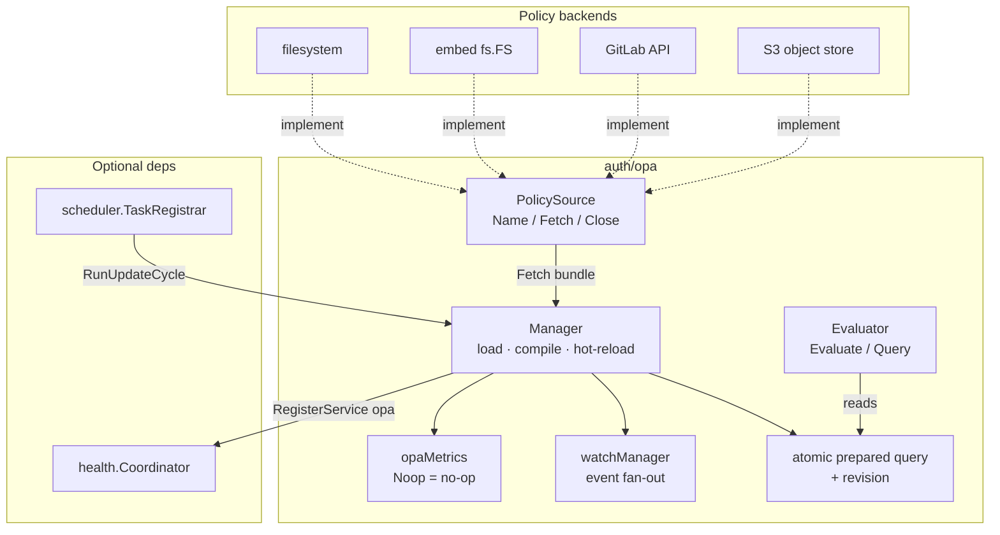
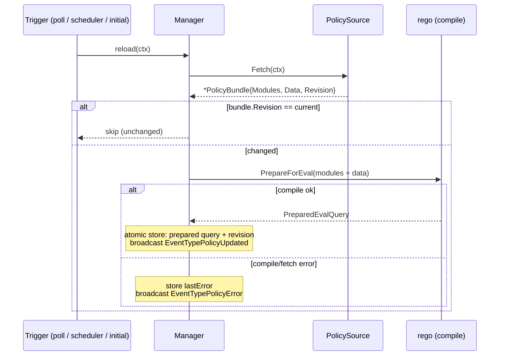

# Open Policy Agent (OPA)

Rego policy evaluation with pluggable policy sources, atomic hot-reload, event subscriptions, scheduled updates, health, and metrics.

---

## Table of Contents

- [Overview](#overview)
- [Architecture](#architecture)
  - [Component Relationships](#component-relationships)
  - [Reload Flow](#reload-flow)
- [Package Map](#package-map)
- [Quick Start](#quick-start)
- [Policy Sources](#policy-sources)
  - [Source Matrix](#source-matrix)
  - [The PolicySource Interface](#the-policysource-interface)
  - [Outbound HTTP (GitLab, S3)](#outbound-http-gitlab-s3)
- [Evaluation](#evaluation)
  - [Boolean vs. Structured Queries](#boolean-vs-structured-queries)
  - [Result](#result)
- [Hot Reload and Change Detection](#hot-reload-and-change-detection)
- [Watching for Policy Events](#watching-for-policy-events)
- [Scheduled Updates](#scheduled-updates)
- [Factory](#factory)
- [Configuration](#configuration)
- [Health](#health)
- [Errors](#errors)
- [Metrics](#metrics)
- [Thread Safety](#thread-safety)

---

## Overview

The `auth/opa` package evaluates [Open Policy Agent](https://www.openpolicyagent.org/) Rego policies for authorization decisions. A
`Manager` loads a `PolicyBundle` from a `PolicySource`, compiles it against a fixed Rego query, and hands out a thread-safe `Evaluator`.
When the source changes, the manager recompiles and swaps the prepared query atomically, so in-flight evaluations always see a consistent
policy set.

The design is modular:

- **Sources are passive.** A `PolicySource` only fetches a bundle. All polling, change detection, and scheduling live in the `Manager`.
- **Reloads are atomic.** A new bundle is compiled into a fresh prepared query and stored behind an `atomic.Pointer`. Readers never block
  on a reload and never observe a half-applied policy set.
- **Updates are event-driven.** Subscribers receive `PolicyEvent`s on update and on error, with configurable buffering and overflow policy.

## Architecture

### Component Relationships



### Reload Flow



Change detection is revision-based: `PolicyBundle.Revision` is a SHA-256 over the sorted module paths/contents (and data). A fetch whose
revision equals the loaded one is a no-op, so a quiet source costs only the fetch.

## Package Map

| File | Responsibility |
|------|----------------|
| `manager.go` | `Manager`, initial load, atomic reload, poll loop, `regoEvaluator` |
| `evaluator.go` | `Evaluator`, `Result`, denial parsing |
| `source.go` | `PolicySource` interface |
| `bundle.go` | `PolicyBundle`, revision hashing, iterators |
| `event.go` | `PolicyEvent`, `EventType`, `WatchOptions`, `WatchResult`, overflow policy |
| `watcher.go` | `watchManager` — subscription fan-out |
| `scheduler.go` | Scheduler task registration (`RunUpdateCycle`) |
| `health.go` | Health check reporting |
| `metrics.go` | `opaMetrics` (reloads, evaluations, latency, modules) |
| `errors.go` | Sentinel errors |
| `options.go` / `options_gen.go` | Functional options |
| `factory/` | Config-driven builder (`factory.New(cfg).…Build(ctx)`) |
| `sources/{embed,filesystem,gitlab,s3}/` | `PolicySource` implementations |

## Quick Start

```go
source, err := filesystem.New("/etc/policies")
if err != nil {
    return err
}

manager, err := opa.NewManager(ctx, source, "data.authz.allow")
if err != nil {
    return err
}
defer manager.Close()

result, err := manager.Evaluator().Evaluate(ctx, map[string]any{
    "user":   "alice",
    "action": "read",
})
if err != nil {
    return err
}
if result.Allow {
    // access granted
}
```

`NewManager` takes the source and the Rego query as positional arguments and performs the initial load before returning, so a nil source,
empty query, or a policy set that fails to compile surfaces immediately rather than on first evaluation.

## Policy Sources

### Source Matrix

| Source | Import | Backend | Notes |
|--------|--------|---------|-------|
| Embed | `sources/embed` | `fs.FS` compiled into the binary | Immutable; revision is fixed at build time |
| Filesystem | `sources/filesystem` | Local directory | Watches via `fsnotify`; reloads on change |
| GitLab | `sources/gitlab` | Repository via GitLab API | Network-backed; supports resilient HTTP client |
| S3 | `sources/s3` | S3-compatible object store | Network-backed; AWS SDK transport, optional proxy |

Each source is a passive fetcher. The `Manager` drives polling at `pollInterval` (default 30s) when watching, or runs cycles on the
scheduler when one is wired.

### The PolicySource Interface

```go
type PolicySource interface {
    Name() string                                  // identifier used in events and logs
    Fetch(ctx context.Context) (*PolicyBundle, error)
    Close() error
}
```

A `PolicyBundle` carries the Rego `Modules` (path → raw content), optional `Data` (JSON loaded into OPA's store), a `Revision` for change
detection, and a `FetchedAt` timestamp. Build one with `NewPolicyBundle(modules)` or `NewPolicyBundleWithData(modules, data)`; both
compute the revision hash for you.

### Outbound HTTP (GitLab, S3)

The GitLab and S3 sources reach external services and accept proxy / retry / breaker configuration through the resilient
[`transport/http/client`](../../transport/http/client/):

- **GitLab** forwards options via `gitlab.WithHTTPClientOptions(...)`; the resilient client is wired unconditionally.
- **S3** swaps the AWS SDK transport via `awsconfig.WithHTTPClient(httpclient.New(...))` only when `s3.proxy` is explicitly configured;
  otherwise the SDK keeps its own transport and retry layer.

See the [Proxy guide](../proxy.md) for YAML modes and the [factory README](../../auth/opa/factory/) for wiring details.

## Evaluation

`Manager.Evaluator()` returns a thread-safe `Evaluator` that reads the current prepared query on every call:

```go
type Evaluator interface {
    Evaluate(ctx context.Context, input any) (*Result, error)
    Query() string
}
```

`Evaluate` returns `ErrPoliciesNotLoaded` if no bundle has been compiled yet, denies (no error) when the query yields nothing, and wraps
any Rego evaluation failure with operation context.

### Boolean vs. Structured Queries

The evaluator accepts two result shapes from the same `Evaluate` call, chosen by what the query returns:

- **Boolean** — a query like `data.authz.allow` returns a plain `bool`. `Result.Allow` is set; `Denials` is nil.
- **Structured** — a query like `data.authz.result` returns `{"allow": bool, "denials": [{"code": "...", "message": "..."}, ...]}`. The
  `allow` flag and the denials map are parsed out.

Any other (unrecognized) result type denies. This keeps simple allow/deny policies trivial while letting richer policies report *why* a
request was denied.

### Result

```go
type Result struct {
    DecisionID string   // set only when decision logging is enabled
    Allow      bool
    Denials    *coremaps.ImmutableMap[string, string] // code → message, nil when Allow
}

func (r *Result) HasDenialCode(code string) bool
```

When decision logging is off, the allow and deny results are pre-allocated singletons, so the common path allocates nothing. Enabling
`WithDecisionLogging` stamps a unique `DecisionID` (UUID) on every result for audit correlation, at the cost of one allocation per
evaluation.

## Hot Reload and Change Detection

`StartWatching(ctx)` spawns a poll loop that fetches the source every `pollInterval` and reloads when the revision changes; `StopWatching()`
ends it, and `IsWatching()` reports the state. A reload:

1. Fetches the bundle. On failure it records `lastError`, broadcasts an error event, and returns `ErrBundleFetchFailed`.
2. Compares revisions. An unchanged revision is a logged no-op.
3. Compiles the modules (and loads any data into a fresh in-memory store). A compile failure broadcasts an error event and returns
   `ErrQueryPrepareFailed`.
4. Atomically swaps the prepared query and revision, updates module count and `lastUpdate`, clears `lastError`, and broadcasts
   `EventTypePolicyUpdated`.

Concurrent update cycles are guarded: if a cycle is already running, the next one returns immediately rather than piling up.

## Watching for Policy Events

Subscribe to reload and error events with `Watch`:

```go
watch, err := manager.Watch(ctx, opa.DefaultWatchOptions())
if err != nil {
    return err
}
defer watch.Stop()

for event := range watch.Events {
    switch event.Type {
    case opa.EventTypePolicyUpdated:
        log.Printf("policies updated: %s (was %s)", event.Revision, event.PreviousRevision)
    case opa.EventTypePolicyError:
        log.Printf("policy error: %v", event.Error)
    }
}
```

`WatchOptions` tunes the subscription: `BufferSize` (default 10), an `EventTypes` filter (empty = all), and a `BufferOverflowPolicy` for a
full buffer:

| Policy | Behavior |
|--------|----------|
| `OverflowPolicyDropNewest` | Drop the incoming event (default). Non-blocking; never delays the producer |
| `OverflowPolicyDropOldest` | Evict the oldest event to admit the newest. Keeps the most recent events |
| `OverflowPolicyBlock` | Block until space frees or the context cancels. Can slow the producer, so use with care |

`WatchResult` exposes the `Events` channel, a `Stop` function, and a `Done` channel closed when the watch ends.

## Scheduled Updates

Instead of (or alongside) the internal poll loop, drive reloads from a cron scheduler. Provide a `core/scheduler.TaskRegistrar` via
`WithScheduler` and a cron expression via `WithUpdateSchedule`:

```go
manager, err := opa.NewManager(ctx, source, "data.authz.allow",
    opa.WithScheduler(reg),
    opa.WithUpdateSchedule("0 */5 * * * *", true), // every 5 minutes, run once on start
)
```

`WithUpdateSchedule` takes the cron expression and a `runOnStart` flag, and only takes effect when a scheduler is wired. The registered
task runs the same guarded update cycle as the poll loop. Calling the scheduler-managed entry point directly returns `ErrSchedulerManaged`.

## Factory

For configuration-driven setup, the [`factory`](../../auth/opa/factory/) package builds a manager from an OPA config block with a fluent,
deferred-error builder: every step accumulates errors and `Build(ctx)` returns the first one:

```go
manager, err := factory.New(cfg.OPA).
    UseLogger(logger).
    UseScheduler(scheduler).
    UseHealthCoordinator(hc).
    Build(ctx)
```

`Build` also materializes each network source's proxy block into client options: GitLab always wires the resilient HTTP client; S3 injects
a custom transport only when its proxy `Mode` is non-empty (otherwise the AWS SDK keeps its own retry layer). A nil/empty proxy block keeps
env-based passthrough (`HTTP_PROXY` / `HTTPS_PROXY` / `NO_PROXY`).

## Configuration

Options are functional, applied to `NewManager`:

| Option | Default | Description |
|--------|---------|-------------|
| `WithLogger` | discard | Structured `*slog.Logger` |
| `WithDecisionLogging` | `false` | Stamp a unique `DecisionID` on every result for audit correlation |
| `WithWatchChannelSize` | 10 | Default buffer size for watch event channels |
| `WithScheduler` | nil | `TaskRegistrar` for scheduler-driven update cycles |
| `WithUpdateSchedule` | — | Cron expression + run-on-start flag (requires `WithScheduler`) |
| `WithHealthCoordinator` | nil | Register the manager with a `health.Coordinator` |

The poll interval defaults to `DefaultPollInterval` (30s). `WithDecisionLogging` is the one option with a runtime cost worth weighing: it
trades a per-evaluation allocation for traceable decision IDs.

## Health

When a `health.Coordinator` is supplied, `NewManager` registers the manager as the `"opa"` service. The health check reflects the manager's
loaded state and last reload outcome, so a source that starts failing surfaces through the standard `/healthz` / `/readyz` probes rather
than silently serving stale policy.

## Errors

| Sentinel | Returned when |
|----------|---------------|
| `ErrSourceRequired` | `NewManager` got a nil source |
| `ErrQueryRequired` | `NewManager` got an empty query |
| `ErrPoliciesNotLoaded` | `Evaluate` called before any bundle compiled |
| `ErrSourceClosed` | Operation on a closed source |
| `ErrManagerClosed` | Operation on a closed manager |
| `ErrNoPolicyFiles` | No policy files found at the configured path |
| `ErrBundleFetchFailed` | Fetching the bundle from the source failed |
| `ErrQueryPrepareFailed` | Compiling the Rego query against the loaded modules failed |
| `ErrWatchStartFailed` | Starting the watch on the source failed |
| `ErrSchedulerManaged` | A scheduler-managed entry point was called directly |
| `ErrInvalidDataPath` | A bundle data key could not be parsed into an OPA store path |

`ErrBundleFetchFailed` and `ErrQueryPrepareFailed` are joined with the underlying cause, so `errors.Is` matches the sentinel while the
original error stays reachable through the chain.

## Metrics

Metrics are published under the `opa` subsystem. With no collector, `metrics.Noop()` is used and every write is a zero-cost no-op.

| Metric | Type | Labels | Description |
|--------|------|--------|-------------|
| `opa_policy_reloads_total` | Counter | `result` | Reload outcomes (`success`, `unchanged`, `fetch_error`, `prepare_error`) |
| `opa_policy_reload_duration_seconds` | Histogram | — | Reload duration |
| `opa_evaluations_total` | Counter | `result` | Evaluation outcomes (`allow`, `deny`, `error`) |
| `opa_evaluation_duration_seconds` | Histogram | — | Evaluation duration |
| `opa_modules_loaded` | Gauge | — | Modules in the currently loaded bundle |

## Thread Safety

All public methods on `Manager` and `Evaluator` are safe for concurrent use. Reloads publish the prepared query and revision through atomic
pointers, so evaluations never block on a reload and never observe a partially applied bundle. Update cycles are de-duplicated, and `Close`
is idempotent.

---

See the package [`README`](../../auth/opa/README.md) and the [`factory`](../../auth/opa/factory/) / source subpackage READMEs for
file-level reference, and [`docs/auth/oidc.md`](oidc.md), [`docs/auth/selfjwt.md`](selfjwt.md), and [`docs/auth/static.md`](static.md) for
the other authentication and authorization building blocks.
