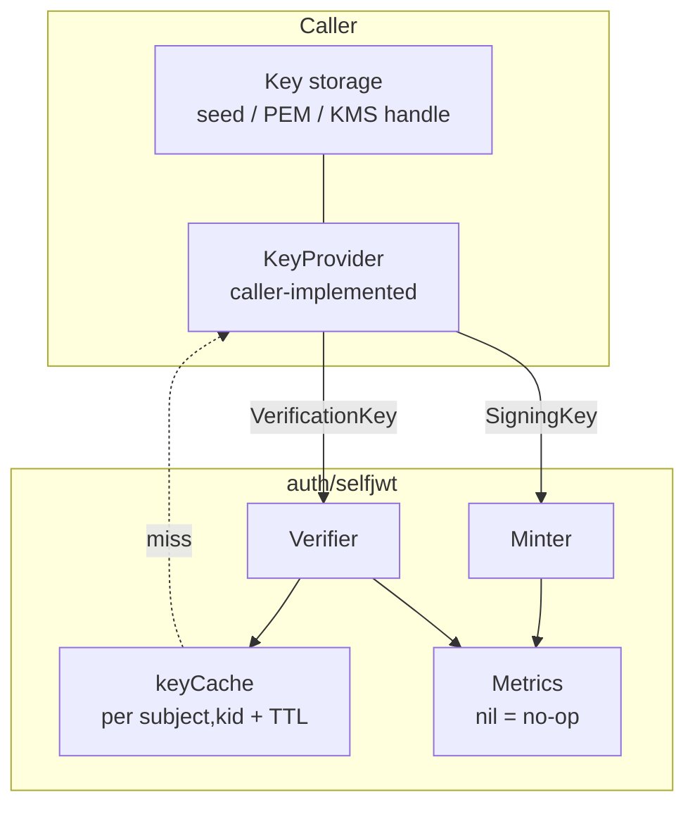
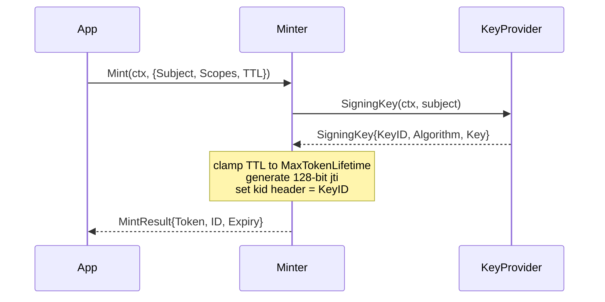
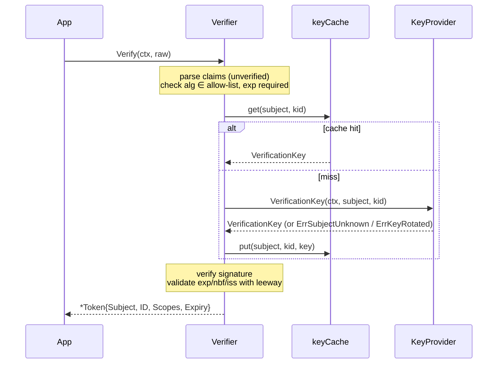

# Self-Issued JWT (selfjwt)

Minting and verification of self-issued, per-subject JWTs for services that are both the issuer and the verifier of their own tokens.

---

## Table of Contents

- [Overview](#overview)
- [When to Use selfjwt vs. oidc](#when-to-use-selfjwt-vs-oidc)
- [Architecture](#architecture)
  - [Component Relationships](#component-relationships)
  - [Mint Flow](#mint-flow)
  - [Verify Flow](#verify-flow)
- [Package Map](#package-map)
- [Quick Start](#quick-start)
- [The KeyProvider Seam](#the-keyprovider-seam)
- [Key Rotation](#key-rotation)
- [Configuration](#configuration)
- [Go API](#go-api)
  - [Minter](#minter)
  - [Verifier](#verifier)
  - [Token](#token)
- [Algorithms](#algorithms)
- [Security Model](#security-model)
- [Verification-Key Cache](#verification-key-cache)
- [Errors](#errors)
- [Metrics](#metrics)
- [Real-World Examples](#real-world-examples)

---

## Overview

The `auth/selfjwt` package mints and verifies JWTs for a service that owns **both ends** of the token lifecycle. A service signs a token
for a subject (a tenant, an account, any principal) with that subject's private key, stamps the signing key's id into the token's `kid`
header, and later verifies the token by resolving the subject's public key for that `kid`.

This closes a loop a generic JWT library leaves open:

1. **Mint** — load the subject's signing key, sign a JWT carrying the subject, a random `jti`, the granted scopes, and the temporal claims.
2. **Verify** — parse the token (allowed algorithms only, `exp` required), resolve the subject's public key by `kid`, check the signature,
   then validate the temporal and issuer claims.
3. **Rotate** — issuing a subject a new `kid` retires the old key; every token still carrying the old `kid` stops verifying.

The package is transport-neutral and algorithm-agnostic. It hard-codes neither a key store nor a signature algorithm: a caller-supplied
[`KeyProvider`](#the-keyprovider-seam) is the only seam to key storage, and the accepted algorithms are an allow-list.

## When to Use selfjwt vs. oidc

| | [`auth/oidc`](oidc.md) | `auth/selfjwt` |
|---|---|---|
| Token issuer | An external identity provider (Keycloak, Auth0, …) | This service |
| Token verifier | This service | This service |
| Key discovery | Remote JWKS over the well-known endpoint | A local `KeyProvider` resolving keys per subject |
| Key granularity | One key set for the issuer | One signing key **per subject**, rotated per subject |
| Revocation | Revocation store / introspection | Key rotation (new `kid` invalidates old tokens) |

Use `oidc` to validate tokens minted elsewhere. Use `selfjwt` when the service issues its own short-lived, per-subject credentials
(service-to-tenant API tokens, download URLs, capability tokens) and wants per-subject key rotation as the invalidation primitive.

## Architecture

### Component Relationships



`Minter` and `Verifier` are independent: a process can do one, the other, or both. They share only the `KeyProvider` contract and the
options struct.

### Mint Flow



### Verify Flow



Concurrent misses for the same `(subject, kid)` are collapsed into a single `KeyProvider` lookup via `singleflight`, so a burst of
requests for an uncached subject cannot stampede the provider.

## Package Map

| File | Responsibility |
|------|----------------|
| `minter.go` | `Minter`, `MintRequest`, `MintResult`, `jti` generation |
| `verifier.go` | `Verifier`, parse → resolve key → verify, singleflight on misses |
| `keys.go` | `KeyProvider`, `SigningKey`, `VerificationKey` |
| `token.go` | `Token` (verified result) and the internal claim set |
| `algorithm.go` | `Algorithm`, the algorithm constants, the default allow-list |
| `cache.go` | `keyCache` — per-`(subject, kid)` TTL cache with a size cap |
| `clock.go` | `Clock` seam (system UTC in production, injectable in tests) |
| `metrics.go` | `Metrics` (mint/verify counters, latency, cache hit/miss) |
| `errors.go` | Sentinel errors |
| `options.go` / `options_gen.go` / `options_manual.go` | Functional options |

## Quick Start

```go
provider := myKeyStore{} // implements selfjwt.KeyProvider

// Issuer side.
minter := selfjwt.NewMinter(provider, selfjwt.WithIssuer("billing"))
res, err := minter.Mint(ctx, selfjwt.MintRequest{
    Subject: tenantID,
    Scopes:  []string{"files:read"},
    TTL:     time.Hour,
})
// res.Token is the serialized JWT; persist res.ID (jti) and res.Expiry as the caller sees fit.

// Verifier side.
verifier := selfjwt.NewVerifier(provider, selfjwt.WithIssuer("billing"))
tok, err := verifier.Verify(ctx, res.Token)
switch {
case errors.Is(err, selfjwt.ErrTokenExpired):
    // expired
case errors.Is(err, selfjwt.ErrSubjectUnknown), errors.Is(err, selfjwt.ErrKeyRotated):
    // unknown subject or rotated-away key
case err != nil:
    // ErrTokenInvalid / ErrAlgorithmNotAllowed
default:
    use(tok.Subject, tok.Scopes, tok.Expiry)
}
```

## The KeyProvider Seam

`KeyProvider` is the single seam between `selfjwt` and a caller's key storage. The package never sees the underlying key format (a seed,
a PEM blob, a KMS handle); the provider returns ready `crypto` keys.

```go
type KeyProvider interface {
    // SigningKey returns the subject's current signing material.
    // Return ErrSubjectUnknown when the subject has no keys.
    SigningKey(ctx context.Context, subject string) (SigningKey, error)

    // VerificationKey resolves a token's kid to the subject's public key,
    // accepting the current key and any retired-but-valid key still inside
    // the rotation overlap window.
    // Return ErrSubjectUnknown when the subject is unknown,
    // ErrKeyRotated when the subject is known but the kid is not.
    VerificationKey(ctx context.Context, subject, kid string) (VerificationKey, error)
}
```

`SigningKey` and `VerificationKey` each carry the `Algorithm` they are used with, plus the raw `crypto.PrivateKey` / `crypto.PublicKey`
whose concrete type must match (`ed25519.PrivateKey` for `EdDSA`, `*ecdsa.PrivateKey` for `ES*`, `*rsa.PrivateKey` for `RS*`/`PS*`).

Returning the right sentinel from the provider matters: `Verifier` propagates `ErrSubjectUnknown` and `ErrKeyRotated` **unwrapped** so a
caller can branch on them with `errors.Is`.

## Key Rotation

Rotation is the invalidation mechanism. Because the signing key's id rides in the token's `kid` header and the verifier resolves the public
key by that `kid`, a caller invalidates a subject's outstanding tokens by issuing the subject a new signing key (a new `kid`):

1. Generate a new key pair for the subject and make it the value returned by `SigningKey`; new tokens carry the new `kid`.
2. Keep the **old** public key resolvable from `VerificationKey` for an overlap window so already-minted tokens keep verifying until they
   expire naturally.
3. Once the overlap window passes the longest possible token lifetime, drop the old key. `VerificationKey` then returns `ErrKeyRotated`
   for the old `kid`, and every lingering token is rejected.

A short overlap window plus a short `MaxTokenLifetime` gives prompt, hard invalidation without a revocation list.

## Configuration

All tunables are functional options applied to both `NewMinter` and `NewVerifier`. Defaults are exported `Default*` constants.

| Option | Default | Applies to | Description |
|--------|---------|------------|-------------|
| `WithIssuer` | `""` (`DefaultIssuer`) | mint + verify | The `iss` claim set on mint and required on verify (when non-empty) |
| `WithMaxTokenLifetime` | 30 days | mint | Ceiling a requested TTL is clamped to; a non-positive TTL uses the maximum |
| `WithClockSkew` | 30s | verify | Leeway applied to `exp` / `nbf` to tolerate clock drift between minter and verifier |
| `WithCacheTTL` | 5m | verify | How long a resolved verification key is cached before reload |
| `WithCacheMaxEntries` | 10000 | verify | Hard cap on cached verification keys; non-positive disables the cap |
| `WithAllowedAlgorithms` | `EdDSA, ES256, RS256` | verify | Replaces the asymmetric-only allow-list; an empty call is ignored |
| `WithMetrics` | nil (no-op) | mint + verify | Attaches a `*Metrics` for counters and latency |
| `WithClock` | system UTC | mint + verify | Injectable clock for deterministic tests |
| `WithRand` | `crypto/rand` | mint | Injectable randomness for the `jti` |

`WithIssuer` is shared deliberately: set the same issuer on both sides so the verifier rejects tokens minted by a different service.

## Go API

### Minter

```go
func NewMinter(src KeyProvider, opts ...Option) *Minter
func (m *Minter) Mint(ctx context.Context, req MintRequest) (MintResult, error)

type MintRequest struct {
    Subject string
    Scopes  []string
    TTL     time.Duration // clamped to MaxTokenLifetime; <= 0 means use the maximum
}

type MintResult struct {
    Token  string    // serialized JWT
    ID     string    // jti — persist for audit / dedupe
    Expiry time.Time // absolute exp
}
```

`Mint` returns `ErrSigningKeyInvalid` when the provider hands back signing material with an empty `KeyID`, and `ErrAlgorithmNotAllowed`
when the signing key names an algorithm not registered with golang-jwt.

### Verifier

```go
func NewVerifier(src KeyProvider, opts ...Option) *Verifier
func (v *Verifier) Verify(ctx context.Context, raw string) (*Token, error)
```

The parser options (valid methods, expiration-required, leeway, issuer) are built once in `NewVerifier`, so `Verify` allocates no option
slice per call.

### Token

```go
type Token struct {
    Subject string    // verified sub claim
    ID      string    // jti
    Scopes  []string  // granted scopes
    Expiry  time.Time // exp
}
```

`Token` is intentionally minimal: registered claims plus scopes. Any richer principal model (roles, superadmin flags, quotas) is the
caller's concern and is built on top of this.

## Algorithms

`Algorithm` is a plain JWA name string. The constants cover the asymmetric algorithms golang-jwt supports out of the box:

| Family | Constants |
|--------|-----------|
| EdDSA | `AlgEdDSA` |
| ECDSA | `AlgES256`, `AlgES384`, `AlgES512` |
| RSA PKCS#1 v1.5 | `AlgRS256`, `AlgRS384`, `AlgRS512` |
| RSA PSS | `AlgPS256`, `AlgPS384`, `AlgPS512` |

`DefaultAllowedAlgorithms()` returns a copy of the verifier's fail-closed default allow-list: `EdDSA`, `ES256`, `RS256`. To support an
algorithm not registered out of the box, register a signing method with golang-jwt via `jwt.RegisterSigningMethod`, then pass it through
`WithAllowedAlgorithms`.

## Security Model

Verification is fail-closed:

- **Algorithm before signature.** The token algorithm is checked against the allow-list **before** the signature is verified, closing
  algorithm-confusion attacks. The default allow-list is asymmetric only; HMAC (`HS256`, …) is intentionally excluded so a symmetric
  secret can never be confused with a public key.
- **Each key is bound to one algorithm.** A `VerificationKey` must name the `Algorithm` it verifies; the verifier rejects a token whose
  algorithm is empty or does not match the resolved key's algorithm, so a key can never be coerced into verifying a different scheme.
- **`exp` is mandatory.** Tokens without an expiry are rejected; temporal claims (`exp` / `nbf`) are validated with the configured
  clock-skew leeway.
- **Singleflight on cache misses.** Concurrent misses for the same `(subject, kid)` collapse into one provider lookup, so an uncached
  subject cannot stampede the key store.

## Verification-Key Cache

`Verifier` caches resolved verification keys per `(subject, kid)` with a TTL (`WithCacheTTL`) so it avoids a provider lookup on every
request. The cache is safe for concurrent use. An expired entry reads as a miss; entries are physically removed only when a capacity-bound
`put` triggers eviction. A hard `WithCacheMaxEntries` cap bounds memory so a churn of short-lived subjects or rotated-away `kid`s cannot
grow the map without bound. Eviction first drops every expired entry and, if that frees nothing, removes entries in map-iteration order
until a slot is free. A non-positive cap leaves the cache unbounded.

## Errors

| Sentinel | Meaning |
|----------|---------|
| `ErrTokenInvalid` | Malformed token, unexpected algorithm, bad signature, or a non-expiry claim failure |
| `ErrTokenExpired` | `exp` is in the past beyond the clock-skew leeway |
| `ErrSubjectUnknown` | `KeyProvider` has no keys for the subject (propagated unwrapped) |
| `ErrKeyRotated` | Subject is known but the `kid` is not — rotated away (propagated unwrapped) |
| `ErrAlgorithmNotAllowed` | Algorithm is unregistered, mismatched, or the resolved key names no algorithm |
| `ErrSigningKeyInvalid` | `Minter` got signing material that cannot produce a verifiable token (e.g. empty key id) |

Always compare with `errors.Is`. `ErrTokenExpired` and `ErrTokenInvalid` wrap the underlying golang-jwt error, so the original cause is
available through the chain.

## Metrics

Pass a `*Metrics` via `WithMetrics` to record telemetry. A nil `*Metrics` is a valid no-op receiver, so metrics are entirely optional.
Construct one with `NewMetrics(collector, subsystem)`; an empty subsystem falls back to `DefaultMetricsSubsystem` (`auth_selfjwt`).

| Metric | Type | Labels | Description |
|--------|------|--------|-------------|
| `auth_selfjwt_mints_total` | Counter | `status` | Token mint attempts |
| `auth_selfjwt_verifications_total` | Counter | `status` | Token verification attempts |
| `auth_selfjwt_mint_duration_seconds` | Histogram | `status` | Mint duration |
| `auth_selfjwt_verify_duration_seconds` | Histogram | `status` | Verification duration |
| `auth_selfjwt_verification_key_cache_lookups_total` | Counter | `result` | Verification-key cache lookups (`hit` / `miss`) |

`status` is `success` or `failure`.

## Real-World Examples

### Per-tenant API tokens

A billing service issues each tenant a short-lived token scoped to the operations the tenant may perform, signed with the tenant's own
key. Compromise of one tenant's key (or a routine rotation) invalidates only that tenant's outstanding tokens, with no shared secret and
no central revocation list.

```go
minter := selfjwt.NewMinter(tenantKeys, selfjwt.WithIssuer("billing"), selfjwt.WithMaxTokenLifetime(15*time.Minute))
res, _ := minter.Mint(ctx, selfjwt.MintRequest{Subject: tenantID, Scopes: []string{"invoices:read"}, TTL: 15 * time.Minute})
```

### Capability / download URLs

Mint a token granting one capability (read one object) with a tight TTL, embed it in a signed URL, and verify it on the download path.
Rotating the subject's key revokes every outstanding URL for that subject at once.

### Internal service mesh, no external IdP

Where running an OIDC provider is overkill, each service verifies peer tokens against keys it already holds via its `KeyProvider`, keeping
the auth surface inside the mesh. Pair with mTLS at the transport layer for channel security; `selfjwt` carries the subject and scopes.

---

See the package [`README`](../../auth/selfjwt/README.md) for the file-level reference, and [`docs/auth/oidc.md`](oidc.md) for validating
externally-issued tokens.
