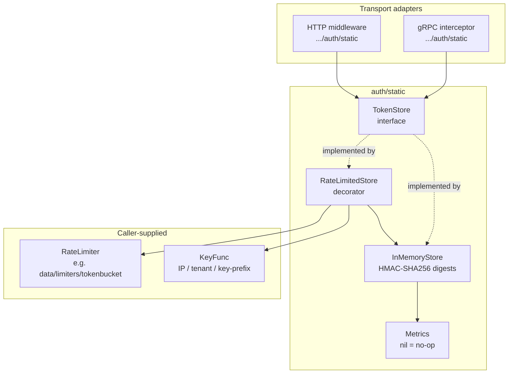
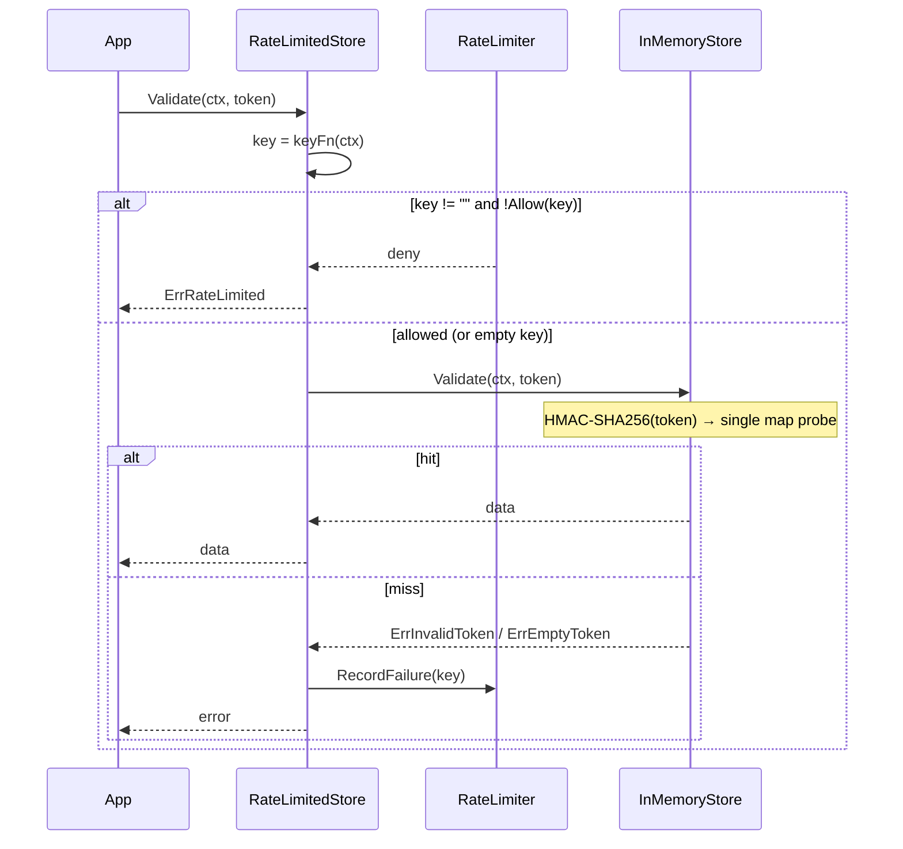

# Static-Token Authentication (static)

Transport-neutral validation of API keys and other pre-shared credentials against an in-memory store keyed by HMAC-SHA256 digests.

---

## Table of Contents

- [Overview](#overview)
- [Architecture](#architecture)
  - [Component Relationships](#component-relationships)
  - [Validation Flow](#validation-flow)
- [Package Map](#package-map)
- [Quick Start](#quick-start)
- [Configuration](#configuration)
- [Go API](#go-api)
  - [TokenStore](#tokenstore)
  - [InMemoryStore](#inmemorystore)
- [Storage and Timing](#storage-and-timing)
- [Stable Cross-Process Digests](#stable-cross-process-digests)
- [Rate Limiting](#rate-limiting)
  - [The Failure-Only Contract](#the-failure-only-contract)
  - [Key Partitioning](#key-partitioning)
- [Errors](#errors)
- [Metrics](#metrics)
- [Transport Integration](#transport-integration)
  - [gRPC](#grpc)
  - [HTTP](#http)
- [Security Notes](#security-notes)

---

## Overview

The `auth/static` package validates pre-shared credentials — API keys, opaque tokens, service keys — without an identity provider. It
exposes a small [`TokenStore`](#tokenstore) interface and a default [`InMemoryStore`](#inmemorystore) that keys tokens by their
HMAC-SHA256 digest, never by plaintext.

It is transport-neutral: the gRPC interceptor at `transport/grpc/interceptors/auth/static` and the HTTP middleware at
`transport/http/server/middlewares/auth/static` are thin adapters over this package — see [Transport Integration](#transport-integration).

Two decorators compose with the core store:

- **[`RateLimitedStore`](#rate-limiting)** — gates validation through a caller-supplied `RateLimiter` to slow brute force.
- **[`Metrics`](#metrics)** — records validation outcomes, latency, and the active-token count.

## Architecture

### Component Relationships



### Validation Flow



## Package Map

| File | Responsibility |
|------|----------------|
| `store.go` | `TokenStore`, `InMemoryStore`, HMAC digesting, `Add`/`Remove`/`TokenCount` |
| `ratelimit.go` | `RateLimiter`, `KeyFunc`, `RateLimitedStore` decorator |
| `metrics.go` | `Metrics` (validations, active tokens, latency) |
| `errors.go` | Sentinel errors |
| `options.go` / `options_gen.go` / `options_manual.go` | Functional options |
| `example_test.go` | Runnable examples |

## Quick Start

```go
store := static.NewInMemoryStore(
    static.WithInitialTokens(map[string]any{
        "sk_live_xxx": UserInfo{ID: "u1", Role: "admin"},
        "sk_test_xxx": UserInfo{ID: "u2", Role: "viewer"},
    }),
)

data, err := store.Validate(ctx, token)
switch {
case errors.Is(err, static.ErrEmptyToken):
    // no credential supplied
case errors.Is(err, static.ErrInvalidToken):
    // reject
case err != nil:
    // other
default:
    user := data.(UserInfo)
    _ = user
}
```

Tokens can be managed at runtime:

```go
store.AddToken("freshly-issued", UserInfo{ID: "u3"})
store.RemoveToken("compromised")
n := store.TokenCount()
```

## Configuration

| Option | Default | Description |
|--------|---------|-------------|
| `WithInitialTokens` | empty | Token → data pairs seeded at construction time |
| `WithMetrics` | nil (no-op) | `*Metrics` recording validations and the active-token count |
| `WithHMACKey` | per-instance 32-byte random key | Stable digest key for cross-process consistency (minimum 16 bytes; shorter values are ignored) |

`WithHMACKey` enforces a `MinHMACKeyBytes` (16) floor — NIST SP 800-107 recommends a key at least as long as the digest size, which for
HMAC-SHA256 is 32 bytes. Keys below the floor are silently ignored and the random default is used.

## Go API

### TokenStore

```go
type TokenStore interface {
    // Validate returns the data associated with token, or an error wrapping
    // ErrInvalidToken / ErrEmptyToken if the token is rejected.
    Validate(ctx context.Context, token string) (any, error)
}
```

Both `InMemoryStore` and `RateLimitedStore` implement `TokenStore`, so they compose transparently and a transport adapter can take either.

### InMemoryStore

```go
func NewInMemoryStore(opt ...Option) *InMemoryStore

func (s *InMemoryStore) Validate(ctx context.Context, token string) (any, error)
func (s *InMemoryStore) AddToken(token string, data any)
func (s *InMemoryStore) RemoveToken(token string)
func (s *InMemoryStore) TokenCount() int
```

The associated data is `any`, so a caller stores whatever principal model fits — a user struct, a role set, a tenant id. The zero value is
not usable; always construct with `NewInMemoryStore`.

## Storage and Timing

`InMemoryStore` keys tokens by their HMAC-SHA256 digest. The plaintext token is hashed at insertion time and discarded; only digests are
retained in memory. A lookup is a single map probe — there is no linear scan and no early-break loop — so timing depends on token length
only, not on token position or membership. The HMAC instance is recycled through a `sync.Pool`, so a steady-state lookup allocates only the
digest byte slice.

## Stable Cross-Process Digests

The default HMAC key is generated from `crypto/rand` once per `InMemoryStore`, so digests are not valid across restarts or across
processes. When several processes must agree on the storage digest of a token — a shared cache, distributed rate-limit keying — pass a
stable key:

```go
store := static.NewInMemoryStore(static.WithHMACKey(secret)) // secret >= 16 bytes
```

## Rate Limiting

`RateLimitedStore` wraps any `TokenStore` and consults a caller-supplied `RateLimiter` before delegating. The package ships **no**
limiter implementation — wire one from `data/limiters/tokenbucket`, a Redis-backed limiter, or any other source through the interface.

```go
limiter := myLimiter // implements static.RateLimiter
store := static.NewRateLimitedStore(inner, limiter, func(ctx context.Context) string {
    return extractClientIP(ctx)
})
```

`NewRateLimitedStore` panics if `store`, `limiter`, or `keyFn` is nil — none has a safe default.

### The Failure-Only Contract

The `RateLimiter` contract is **failure-only**:

```go
type RateLimiter interface {
    Allow(ctx context.Context, key string) bool        // pure check — MUST NOT consume budget
    RecordFailure(ctx context.Context, key string)     // the only path that debits the budget
}
```

`Allow` is a pure check that must not consume budget by itself; `RecordFailure` is the only path that debits the per-key counter.
Successful validations never touch the limiter. This shape defeats the success-resets-counter brute-force bypass: if a success could reset
(or even refund) the budget, an attacker holding a single valid token could interleave one valid attempt with N invalid attempts and the
invalid attempts would never accumulate.

Because the decorator never refunds, the limiter **must self-decay** (token-bucket refill, sliding window, TTL'd counter). A monotonic
counter that never decays will eventually lock legitimate clients out of their own tokens.

### Key Partitioning

`KeyFunc` derives the rate-limit key for a request — typically the client IP, an API-key prefix, or a tenant id.

- Returning an **empty string** skips the rate-limit check for that request (useful for trusted internal traffic).
- Returning the **same non-empty key for every request is forbidden by contract**: the limiter then becomes one global bucket and a single
  attacker can trip `ErrRateLimited` for every legitimate user (DoS amplification). Partition by an attribute correlated with the suspected
  attacker (IP, ASN, account, tenant), never a constant.

The key is never embedded in the returned error text, keeping client identifiers out of logs and gRPC/HTTP error payloads.

## Errors

| Sentinel | Returned when |
|----------|---------------|
| `ErrInvalidToken` | Token is non-empty but not registered with the store |
| `ErrEmptyToken` | Token is the empty string |
| `ErrRateLimited` | `RateLimitedStore` rejects a request via its `RateLimiter` |

Compare with `errors.Is`, not `==` — the transport adapters wrap these with additional context while preserving the cause.

## Metrics

Pass a `*Metrics` via `WithMetrics`. A nil `*Metrics` is a valid no-op receiver. Construct one with `NewMetrics(collector, subsystem)`; an
empty subsystem falls back to `DefaultMetricsSubsystem` (`auth_static`).

| Metric | Type | Labels | Description |
|--------|------|--------|-------------|
| `auth_static_validations_total` | Counter | `status` | Token validation attempts |
| `auth_static_tokens_active` | Gauge | — | Current number of active tokens in the store |
| `auth_static_validation_duration_seconds` | Histogram | — | Validation duration |

`status` is `success` or `failure`. `tokens_active` is republished on every `AddToken` / `RemoveToken` and on construction.

## Transport Integration

Both adapters re-export the `auth/static` types and options verbatim and add only an `AuthFunc` that maps this package's sentinels into the
transport's error model. Configure the store with `auth/static`; the adapter wires it into the interceptor or middleware.

### gRPC

`transport/grpc/interceptors/auth/static` provides `AuthFunc`, translating sentinels into gRPC status codes:

| `auth/static` error | gRPC status code |
|---------------------|------------------|
| `ErrInvalidToken` | `codes.Unauthenticated` |
| `ErrEmptyToken` | `codes.Unauthenticated` |
| `ErrRateLimited` | `codes.ResourceExhausted` |
| anything else | `codes.Internal` |

```go
store := static.NewInMemoryStore(static.WithInitialTokens(tokens))
interceptor := auth.ServerInterceptor(
    auth.WithAuthFn(staticgrpc.AuthFunc(store)),
)
```

### HTTP

`transport/http/server/middlewares/auth/static` provides `AuthFunc`, wrapping store errors with `auth.ErrUnauthorized` while preserving the
original cause for logs and custom `auth.ErrorHandler` implementations. Branch with `errors.Is(err, auth.ErrUnauthorized)` or
`errors.Is(err, static.ErrInvalidToken)`.

## Security Notes

- Plaintext tokens are hashed and discarded at insertion; only HMAC-SHA256 digests live in memory, and lookups are constant-time with
  respect to membership and position (timing depends on token length only).
- The default HMAC key is per-instance and ephemeral — pass `WithHMACKey` only when cross-process digest stability is genuinely needed.
- Always transport tokens over TLS and rotate them on a schedule. Apply brute-force protection at a higher layer via `RateLimitedStore` or
  a transport-level rate limiter; the store itself does not throttle.

---

See the package [`README`](../../auth/static/README.md) for the file-level reference, and [`docs/auth/oidc.md`](oidc.md) /
[`docs/auth/selfjwt.md`](selfjwt.md) for token-based authentication.
