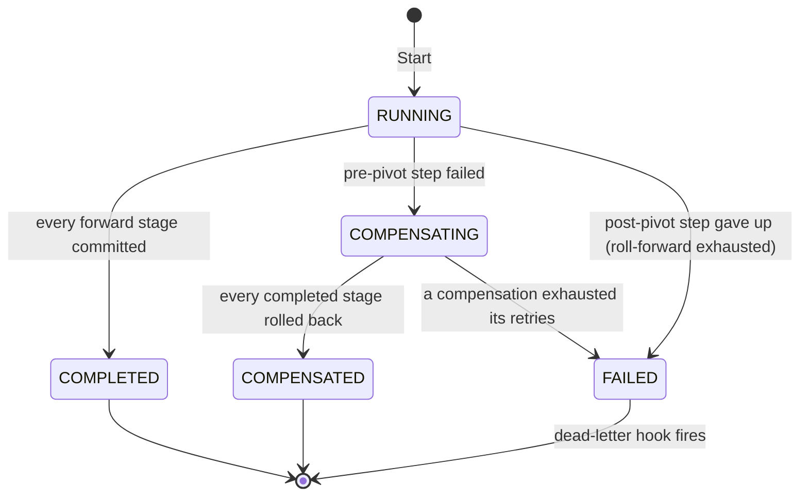
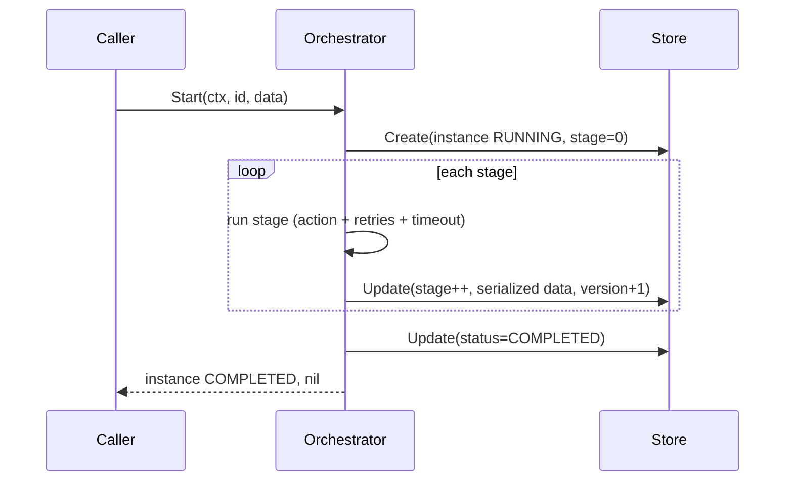
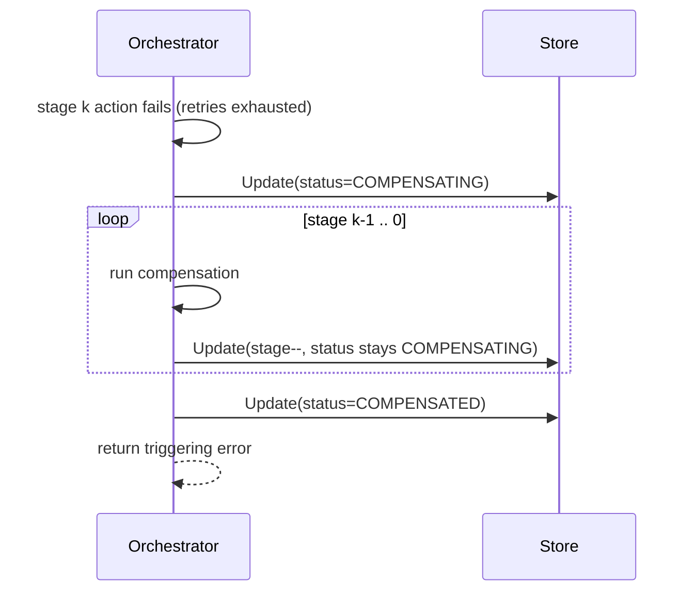
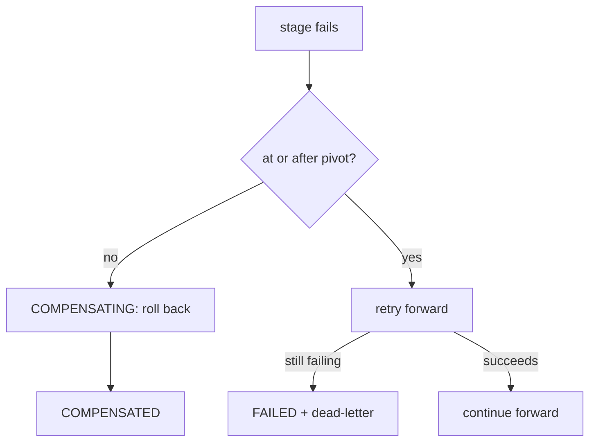
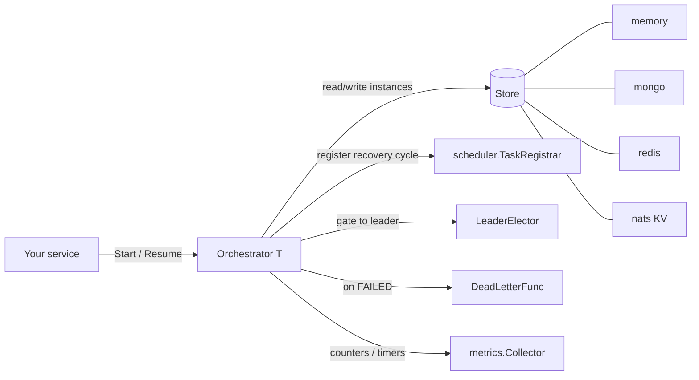
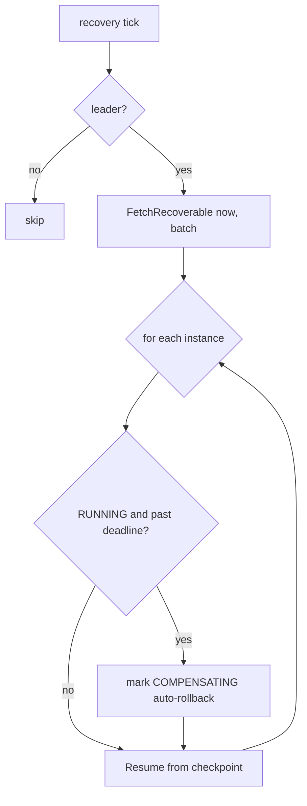

# Saga orchestration

This guide explains the [`data/saga`](../../data/saga) package: what an orchestration saga is, how the engine drives one, how it survives
crashes, and how to wire a durable backend. For the terse API reference see the package [`README`](../../data/saga/README.md); this page is the
narrative version with diagrams and worked examples.

## What problem it solves

A business operation that spans several services (reserve stock, charge a card, ship an order) has no shared database transaction. If the
third step fails, the first two have already committed their side effects. A saga makes the operation *eventually atomic*: it runs a sequence
of local steps and, when one fails, runs the previously completed steps' compensations in reverse to undo their effects. The result leaves no
partial state.

Use a saga when:

- the work crosses transactional boundaries (multiple services, or a DB plus an external API);
- each step can be undone by an idempotent compensation (release the hold, refund the charge);
- you can tolerate brief inconsistency between a step committing and its compensation running.

Do **not** reach for a saga when a single local transaction (or the [outbox](../../data/outbox) pattern for "DB write + publish") already gives
you atomicity.

## Core model

| Concept             | What it is                                                                                                              |
|---------------------|-----------------------------------------------------------------------------------------------------------------------|
| `Definition[T]`     | An immutable, validated blueprint: an ordered list of stages plus the compensation policy. Built once at startup.     |
| Stage               | One position in the saga: a single step, or a parallel group that runs and compensates concurrently.                  |
| `Step[T]`           | A forward action (`StepFunc[T]`) plus an optional compensation (`CompensateFunc[T]`) and per-step overrides.          |
| Pivot               | The point of no return. Failures **at or after** the pivot stage roll forward (retry) instead of compensating.        |
| `Orchestrator[T]`   | Drives one `Definition` over a `Store`. `Start` runs a new instance; `Resume` continues a persisted one.              |
| `Instance`          | The persisted state of one execution: status, stage cursor, serialized data, version, deadline, step history.         |
| `Store`             | The persistence backend. Reads and writes whole instances; defined on the consumer side so backends depend on saga.   |

The orchestrator is generic over the saga's shared data type `T`. Each step receives `*T` by pointer so it can read inputs and record outputs
for later steps and compensations. The orchestrator serializes `T` into the persisted checkpoint after every stage.

## Status lifecycle

An instance moves through five statuses; three are terminal.



| Status         | Meaning                                                                                            | Terminal |
|----------------|----------------------------------------------------------------------------------------------------|----------|
| `RUNNING`      | Executing forward stages.                                                                           | no       |
| `COMPENSATING` | A pre-pivot step failed; rolling back completed stages in reverse order.                            | no       |
| `COMPLETED`    | Every forward stage committed.                                                                      | yes      |
| `COMPENSATED`  | Every completed stage was rolled back successfully.                                                 | yes      |
| `FAILED`       | Unrecoverable: a compensation gave up, or a post-pivot stage could not roll forward. Needs a human. | yes      |

The cursor is `Instance.Stage`. While `RUNNING` it is the index of the next forward stage to execute (equivalently, the count of committed
stages). While `COMPENSATING` it is the exclusive upper bound of stages still to undo — compensation walks `Stage-1` down to `0`.

## How execution works

### Forward path with checkpoints

The orchestrator persists a checkpoint after **every** stage, so an instance can resume from where it stopped. The version field on each
write is an optimistic-concurrency token: `Store.Update` is a compare-and-set, so two coordinators can never advance the same instance.



If `Start` is called again with the same `id`, it does not start anew: the duplicate `Create` returns `ErrInstanceExists`, and `Start`
transparently resumes the existing instance. The ID doubles as an idempotency key.

### Failure before the pivot → compensation

When a pre-pivot step fails after its retries, the orchestrator flips the instance to `COMPENSATING`, persists that, then walks completed
stages in reverse running each compensation. A step with no compensation (a read-only step) is skipped.



`Start` returns the original triggering error and an instance in `COMPENSATED` state. If any compensation itself exhausts its retries the
instance goes to `FAILED` (wrapping `errs.ErrCompensationFailed`) and the dead-letter hook fires.

### The pivot: roll forward instead of back

Some steps cannot be undone, or must not be (once the card is charged and the goods shipped, "un-shipping" makes no sense). Mark the last
reversible step — or the first irreversible one — as the **pivot**. Failures at or after the pivot stage do not compensate; the orchestrator
keeps retrying forward, and if it still cannot proceed it moves the instance to `FAILED` and dead-letters it for manual intervention.



## Architecture

The orchestrator is the only moving part callers touch. Everything else plugs in behind a narrow interface and defaults to a safe no-op when
unset.



- **Store** — the one required dependency. Pick a backend by deployment: `memory` for a single node or tests, `mongo`/`redis`/`nats` for
  durable multi-node setups. All four satisfy the same contract.
- **Scheduler** — optional. When set with a recovery schedule, the orchestrator registers a background cycle that resumes stalled instances
  and auto-rolls-back timed-out ones.
- **LeaderElector** — optional. Gates the recovery cycle so only the elected leader scans the store. This is an optimization, not a
  correctness requirement: the store's optimistic concurrency already makes concurrent cycles safe.
- **DeadLetterFunc** — optional. Fires with a clone of the instance when it reaches `FAILED`, so you can alert or enqueue for a human.
- **Collector** — optional Prometheus metrics. Defaults to a no-op.

## Crash recovery

Two things can leave an instance non-terminal: a process crash mid-flight, or a step that overran its saga deadline. The recovery cycle
handles both. It fetches recoverable instances — those past their deadline, or left mid-compensation — and drives each one.



What this gives you:

- **Idempotent steps are mandatory.** On resume, the interrupted stage runs again — the checkpoint advances only *after* a stage commits, so
  a crash between "side effect done" and "checkpoint written" replays that step. Actions and compensations must tolerate re-execution.
- **Deadlines enable auto-rollback.** Set `WithSagaTimeout` to give each instance a wall-clock deadline. A `RUNNING` instance past its
  deadline is flipped to `COMPENSATING` by recovery and rolled back.
- **Version conflicts are benign.** If two coordinators race, the loser's `Update` returns `ErrVersionConflict`; recovery treats that as "the
  other node owns this instance" and moves on.
- **Granularity.** Durable backends (mongo, redis) store the deadline as Unix seconds, so recovery eligibility is evaluated at one-second
  granularity. The minute-scale tick makes that immaterial.

## Examples

### Minimal saga (in-memory)

```go
type Order struct {
    ID        string
    StockHold string
    ChargeID  string
}

def := saga.NewDefinition[Order]("place-order").
    Step("reserve-stock", reserveStock).Compensate(releaseStock).
    Step("charge-card", chargeCard).Compensate(refund).Pivot().
    Step("ship", ship). // post-pivot: rolls forward, never compensated
    MustBuild()

orch := saga.New(memory.New(), def,
    saga.WithStepTimeout(10*time.Second),
    saga.WithSagaTimeout(5*time.Minute),
)

inst, err := orch.Start(ctx, order.ID, order)
if err != nil {
    // inst.Status is StatusCompensated (rolled back) or StatusFailed (needs intervention).
}
```

A step function reads and mutates the shared data:

```go
func reserveStock(ctx context.Context, o *Order) error {
    hold, err := inventory.Reserve(ctx, o.ID)
    if err != nil {
        return err // triggers retries, then compensation of earlier steps
    }
    o.StockHold = hold // recorded in the next checkpoint, visible to releaseStock
    return nil
}

func releaseStock(ctx context.Context, o *Order) error {
    return inventory.Release(ctx, o.StockHold) // must be idempotent
}
```

### Parallel stage

Steps in a parallel group run concurrently on the forward path (fail-fast: any failure fails the stage) and their compensations run
concurrently on rollback. Because they share `*T`, parallel members must not write overlapping fields.

```go
def := saga.NewDefinition[Order]("place-order").
    Step("reserve-stock", reserveStock).Compensate(releaseStock).
    Parallel("notify",
        saga.NewStep("email", sendEmail).Compensate(unsend),
        saga.NewStep("audit", writeAudit).ReadOnly()). // no compensation, declared read-only
    Step("charge-card", chargeCard).Compensate(refund).Pivot().
    MustBuild()
```

### Per-step retry and timeout overrides

Defaults come from the orchestrator options; any step can override them.

```go
def := saga.NewDefinition[Order]("place-order").
    Step("charge-card", chargeCard).
        Compensate(refund).
        Timeout(3 * time.Second).
        Retry(5, 200*time.Millisecond, 2*time.Second). // attempts, base delay, max delay
        Pivot().
    MustBuild()
```

Stop retrying on permanent errors with a predicate:

```go
orch := saga.New(store, def,
    saga.WithShouldRetry(func(err error) bool { return !errors.Is(err, ErrCardDeclined) }),
)
```

### Durable backend via the factory

In production, assemble the orchestrator from [`config.Saga`](../../config/saga.go) and an injected client. The factory picks the store named by
`config.Saga.Storage.Type` and wires every option.

```go
cfg := config.DefaultSaga()
cfg.Storage = &config.SagaStorageConfig{
    Type:  config.SagaStorageTypeRedis,
    Redis: &config.SagaRedisStorageConfig{KeysPrefix: "saga:"},
}

orch, err := factory.New(&cfg, def).
    UseRedisClient(rdb).
    UseScheduler(scheduler).      // registers the background recovery cycle
    UseLeaderElector(leader).     // only the leader runs recovery
    UseOnDeadLetter(alertOnFail).
    Build()
```

The YAML equivalent (see [`config/templates/saga.yaml`](../../config/templates/saga.yaml)):

```yaml
saga:
  storage:
    type: redis
    redis:
      keys_prefix: "saga:"
      ttl: 0s            # 0 = persist; terminal instances are not auto-deleted
  step_timeout: 10s
  saga_timeout: 5m       # enables auto-rollback by the recovery cycle
  recovery_schedule: "@every 1m"
```

### Running recovery manually

Without a scheduler you can drive a single pass yourself (a cron job, a test):

```go
if err := orch.RunRecoveryCycle(ctx); err != nil {
    // ErrSchedulerManaged is returned if a scheduler already owns the cadence.
}
```

## Storage backends

| Backend  | Package                                                  | Durable | Version token        | Recovery scan                                  | Notes                                          |
|----------|---------------------------------------------------------|---------|----------------------|------------------------------------------------|------------------------------------------------|
| `memory` | [`storages/memory`](../../data/saga/storages/memory)       | no      | in-struct counter    | map scan                                       | Single node, tests, reference implementation.  |
| `mongo`  | [`storages/mongo`](../../data/saga/storages/mongo)         | yes     | document `version`   | `(status, deadline)` compound index            | Query-capable; one document per instance.      |
| `redis`  | [`storages/redis`](../../data/saga/storages/redis)         | yes     | hash field, Lua CAS  | sorted set scored by recover-eligibility time  | No auto-delete without a TTL — see retention.  |
| `nats`   | [`storages/nats`](../../data/saga/storages/nats)           | yes     | KV revision          | full bucket scan                               | Bucket carries a long backstop TTL by default. |

All backends return the same sentinel errors from [`errs`](../../data/saga/errs) (`ErrInstanceNotFound`, `ErrInstanceExists`,
`ErrVersionConflict`, …); match them with `errors.Is`.

## Compensation policy

Forgetting a compensation silently ships a saga whose rollback is incomplete. The build-time policy guards against that for compensatable
steps — those before the pivot and not marked `ReadOnly`.

| Policy             | Effect                                                                                  |
|--------------------|-----------------------------------------------------------------------------------------|
| `PolicyWarn`       | Default. `Build` succeeds; `New` logs a warning naming the steps that lack compensation. |
| `PolicyEnforce`    | `Build` returns `ErrNoCompensation` (and `MustBuild` panics).                            |
| `PolicyDisabled`   | Turns the check off.                                                                     |

```go
def, err := builder.Build(saga.WithCompensationPolicy(saga.PolicyEnforce))
```

## Metrics

When a `metrics.Collector` is configured, the orchestrator records the following under the `saga` subsystem (the collector prepends its
namespace, e.g. `myapp_saga_started_total`).

| Metric                         | Type      | Meaning                                                       |
|--------------------------------|-----------|---------------------------------------------------------------|
| `started_total`                | counter   | Instances started.                                            |
| `completed_total`              | counter   | Instances that committed all stages.                          |
| `compensated_total`            | counter   | Instances that fully rolled back.                             |
| `failed_total`                 | counter   | Instances that entered the unrecoverable `FAILED` state.      |
| `in_flight`                    | gauge     | Instances currently executing.                                |
| `steps_executed_total`         | counter   | Forward step actions that committed.                          |
| `step_failures_total`          | counter   | Forward step actions that failed after retries.               |
| `step_retries_total`           | counter   | Step action retry attempts.                                   |
| `compensations_total`          | counter   | Compensations that ran successfully.                          |
| `compensation_failures_total`  | counter   | Compensations that failed after retries.                      |
| `recovery_cycles_total`        | counter   | Background recovery cycles executed.                          |
| `recovered_total`              | counter   | Stalled or timed-out instances picked up by recovery.         |
| `stage_duration_seconds`       | histogram | Duration of forward stage execution.                          |

## Gotchas

- **Idempotency is not optional.** Both actions and compensations may run more than once across retries and crash recovery. Design them to be
  safe to repeat (use external idempotency keys, upserts, conditional writes).
- **Parallel members share `*T`.** Concurrent steps in a group must not write the same fields; if they must produce outputs, give each its own
  field or use a separate stage.
- **Terminal instances are not garbage-collected.** Completed and failed instances stay in the store for inspection. Set a TTL (redis/nats) or
  delete them on a retention schedule.
- **The pivot is a deliberate, one-time marker.** There should be at most one. Everything before it is reversible; everything at or after it
  rolls forward.

## See also

- [`data/saga/README.md`](../../data/saga/README.md) — API reference and full option table.
- [docs/configuration.md](../configuration.md) — how config is loaded from YAML, env, and secrets.
- [docs/metrics.md](../metrics.md) — the full metrics catalog across subsystems.
